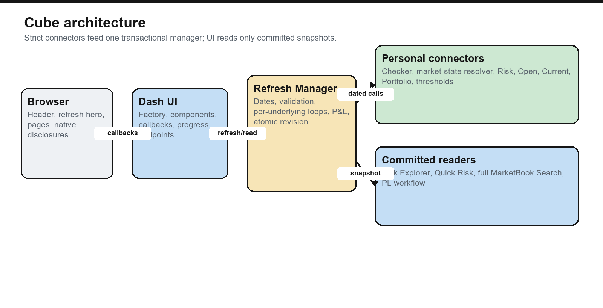
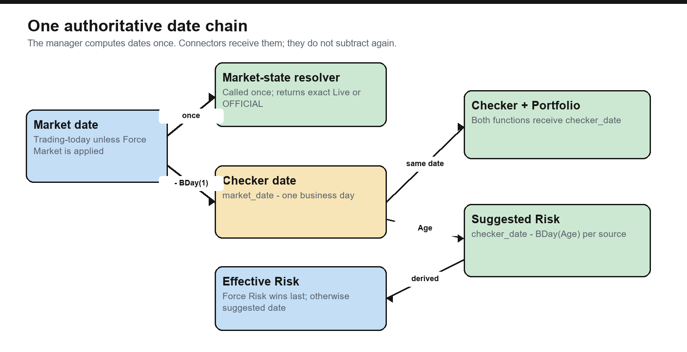
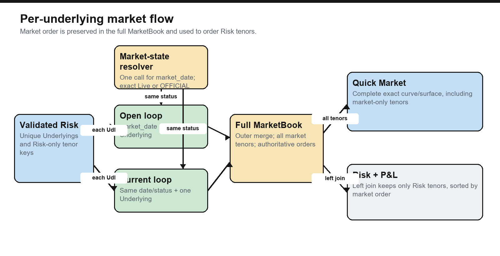

# Rebirth — Risk & P&L

Rebirth is a reconstructed Dash application for loading dated risk, fetching per-underlying market
data, calculating product P&L, exploring the resulting cube, checking risk
readiness, and preparing governed P&L submissions.

The supplied recovery fragments are the primary source for this repository;
the clean Final Test implementation was used only to resolve missing or damaged
structure. The checked-in runtime is deliberately fixture-only: its connectors
read clearly marked fake CSV data and do not import private market libraries,
credentials, or production endpoints. Replace the feed boundary deliberately
before any production use.

The private source repository is <https://github.com/streamlitdash/Rebirth>.
No inherited Plotly Cloud application ID is committed; the first deliberate
deployment must create or select its own target.

## Start here

```powershell
python -m venv .venv
.\.venv\Scripts\Activate.ps1
python -m pip install -r requirements-dev.txt
python s01_app.py
```

Open <http://127.0.0.1:8050>. The navigation shell and refresh controls paint
first. The completed layout response then schedules one delayed background
worker; browser `/startz` and interval signals are idempotent recovery paths to
that same writer.

Run the quality gates with:

```powershell
python -m pytest -q
python -m ruff check .
python -m ruff format --check .
```

The clean suite covers schemas, dates, adapters, market routing, tenor order,
P&L, adjustment storage, UI components, cashflows, feed caching, and a full
fake-data refresh. The reconstructed handoff has **123 passing tests**; run the
suite locally because the count will grow as connector contracts are extended.
The exact final gates are recorded in
[`RECONSTRUCTION.md`](RECONSTRUCTION.md).
Dash 4.4 emits an upstream deprecation warning for native DataTable; that warning
is expected here because the governed editor deliberately does not use AG Grid.
It is not a failed quality gate, and the pinned Dash version is lifecycle-tested.

## The mental model

If you know ordinary Python but are new to Dash, remember this distinction:

- A Streamlit interaction commonly reruns the script from top to bottom.
- Dash creates a component tree once, then calls only the Python callback whose
  declared `Input` changed.
- A component has an `id`. A callback connects one or more component properties
  to Python. The callback returns new properties for its `Output` components.
- Expensive data belongs behind the refresh manager, not inside layout builders
  or every tab callback.

The application is therefore split into four layers:

1. **Connectors** retrieve canonical DataFrames.
2. **Core** validates, joins, calculates, caches, and commits a snapshot.
3. **UI preparation** converts the committed snapshot into display aggregates.
4. **Dash components and callbacks** render and update only what the user asked
   to see.



## File order and naming

Python modules use `s01_`, `s02_`, and so on because a normal importable Python
module cannot begin with a digit. The number gives a stable reading/dependency
order; the text after it is one word with one short responsibility. Counting
restarts inside each folder. Additive extensions take the next free number so
existing import paths do not have to be renamed.

Standard ecosystem names such as `README.md`, `.gitattributes`,
`requirements.txt`, `plotly-cloud.toml`, and `__init__.py` are unavoidable
tooling exceptions.

### Root

| File | Responsibility |
|---|---|
| `s01_app.py` | Composition root. Connects settings, feeds, storage, PL actions, and the Dash factory. Importing it does not load risk. |
| `s02_config.py` | Environment parsing and proxy/path configuration. |
| `s03_publish.py` | Builds a temporary Plotly runtime bundle and publishes it. The repository itself has no `app.py` forwarding shim. |
| `s04_server.py` | Gunicorn process/thread settings. |

### `core/`

| File | Responsibility |
|---|---|
| `s01_schema.py` | One registry for Portfolio, Product, Activity, SignoffGroup, Category, Sub Category, and their UI roles. |
| `s02_pipeline.py` | Product catalogue, strict validation, date rules, market/risk joins, P&L, portfolio enrichment, refresh transaction, and progress. |
| `s03_search.py` | Revision-local indexed Risk Search and full-MarketBook Search. |
| `s04_pl.py` | Pure PLSEND mapping, aggregation, governance, overlays, and saved-P&L construction. |
| `s05_storage.py` | Validated, transactional `adjustments/date/portfolio--hash.csv` repository. |
| `s06_cashflow.py` | Framework-independent Intraday Cashflows schema, date normalization, connector protocol, and validation. |
| `s07_reporting.py` | Exact CSV validation and post-P&L attachment of `Reported Underlying`. |

### `feeds/` and `adapters/`

| File | Responsibility |
|---|---|
| `feeds/s01_sources.py` | The site-owned boundary: checker, risk, market, portfolios, thresholds, cashflows, senders, and manager composition. |
| `adapters/s01_common.py` | Exact-schema/status helpers shared by personal adapters. |
| `adapters/s02_ir.py` | Working IR Delta curve and IR DeltaVega surface examples. |
| `adapters/s03_commo.py` | Working Commodity Delta curve example. |
| `adapters/s04_credit.py` | Working Credit Delta curve and credit-measure example. |

### `ui/`

| File | Responsibility |
|---|---|
| `s01_contracts.py` | Protocols that keep the UI independent from the concrete manager. |
| `s02_constants.py` | Display fields, hierarchy fields, metrics, and the two detail pickers. |
| `s03_aggregate.py` | Canonical-to-display conversion, filters, hierarchy aggregation, and tenor detail preparation. |
| `s04_components.py` | Pure Dash component, table, chart, date-panel, shell, and page builders. |
| `s05_cashflows.py` | Pure Intraday Cashflows page/component builder; the schema and loader boundary live in `core/s06_cashflow.py`. |
| `s05_staticdata.py` | Path-safe selector and table builder for approved fixture/static CSV files. |
| `s06_plview.py` | The four collapsible P&L workflow sections and native editable DataTables. |
| `s07_events.py` | Startup coordinator and Risk/Cashflow/search/date callbacks. |
| `s08_plevents.py` | Adjustment editors, send actions, and Write P&L callbacks. |
| `s09_factory.py` | Dash/Flask construction, routing, health, and progress endpoints. |

### Other folders

- `assets/s01_style.css` is the pastel visual system.
- `assets/s02_app.js` owns keyboard shortcuts, delegated chevrons, cell-range
  selection, clipboard copying, selection dismissal, and progress polling.
- `assets/s03_select.js` keeps native Dash DataTable selections stable.
- `data/s01_*.csv` through `s09_*.csv` are explicit fake inputs.
- `tools/s01_fixtures.py` deterministically rebuilds and validates fake data.
- `tools/s02_manual.py` creates the diagrams and this manual's PDF.
- Tests are uniquely numbered from `s01_schema.py` through `s16_overlays.py`:
  schema, checker/dates, adapters, MarketBook, P&L/storage, UI, integration,
  cashflow contract, feed cache, lazy P&L/factory behavior, targeted snapshot
  reads, deterministic fixture generation, cold-start ownership/watchdog, then
  the Plotly deployment bundle and entrypoint, reporting-identity mapping, then
  Cross Gamma/New Position overlays.

| Test file | Main boundary proved |
|---|---|
| `tests/s01_schema.py` | Portfolio registry and product/axis catalogue. |
| `tests/s02_checker.py` | Checker date, readiness completion, inventory, and progress-delay validation. |
| `tests/s03_adapters.py` | Executable IR, Commodity, and Credit personal-adapter examples. |
| `tests/s04_market.py` | Dynamic status routing, full MarketBook, risk-only join, and tenor order. |
| `tests/s05_pl.py` | P&L mapping/overlay/export and transactional adjustment storage. |
| `tests/s06_ui.py` | Lazy chevrons, the two-axis tenor contract, dynamic status/Move axes, semantic total-row styling, and visible market ranks. |
| `tests/s07_integration.py` | End-to-end fake refresh, trading-timezone dates, one-call status routing/transitions, Portfolio-only preservation, and force validation. |
| `tests/s08_cashflow.py` | Page-independent cashflow schema and dated loader. |
| `tests/s09_feeds.py` | Narrow fake Source Type/Underlying partition reuse. |
| `tests/s10_plui.py` | Outer/child P&L laziness and no-config factory behavior. |
| `tests/s11_reads.py` | Defensive targeted reads copy only the requested committed frame. |
| `tests/s12_fixtures.py` | ProductSpec-driven fake schemas, axes, and exact deterministic generation. |
| `tests/s13_startup.py` | Shell-first startup, one writer, pod-restart recovery, public/internal prefix routing, active-call watchdog, and retryable failures. |
| `tests/s14_publish.py` | Minimal Plotly bundle contents and native Cloud entrypoint discovery. |
| `tests/s15_reporting.py` | Cross-product Reported Underlying validation, post-P&L aggregation, thresholds, and raw-market separation. |
| `tests/s16_overlays.py` | Cross Gamma/New Position validation, replacement, atomic publication, and dashboard release. |

## What happens on startup


1. Python imports `s01_app.py` and creates connector callables, the manager,
   repositories, and the Dash app. It does **not** call the checker or risk.
2. The browser receives the header, page links, refresh strip, and progress hero.
3. After that first layout response, the server schedules the initial refresh
   with a short delay. The browser also calls the idempotent `/startz` endpoint,
   while `initial-load-trigger` remains an independent fallback. All three paths
   converge on the same process-wide `StartupCoordinator`; none can create a
   duplicate writer.
4. The coordinator assigns a server boot ID and attempt ID, then creates one
   daemon worker. Other browsers follow that exact attempt.
5. The manager builds revision 1 outside the Dash request thread. `/progressz`,
   `/startz`, and `/healthz` remain lock-light and responsive.
6. Only after the whole snapshot validates does the manager atomically commit
   it. The browser mounts the full page once. If a Plotly pod restarts during
   this sequence, the changed boot ID is detected, an idle replacement worker is
   restarted idempotently, and a request-fresh layout can recover the completed
   revision.

The default startup watchdog is 2,400 seconds. A watchdog expiry reports the
active function/source/underlying and keeps following the original worker. It
does not start a second writer while an unknown connector call is still alive.
Every real HTTP, database, or file connector should also have its own I/O
timeout; Python cannot safely kill an arbitrary blocked thread.

The progress hero is not a scripted animation. The manager writes the actual
callable name, Source Type, Underlying, loop position, stage, and update time to
an independently readable progress object. The browser polls the exact public
`/progressz` URL supplied by the server without taking a snapshot DataFrame
lock. The Flask route separately uses the internal route prefix, so reverse
proxies cannot silently send progress requests to the wrong path.

A transport failure now says that refresh state is **not confirmed**, includes
the actual timeout/HTTP/content error, and retries with bounded backoff. It never
claims that a refresh is still being followed without server evidence. After a
long connection loss the page performs one guarded recovery reload; a
request-fresh Dash layout serves the completed revision if it already exists.
A persistent connector failure is logged with an incident ID and exposes Retry
without publishing a partial snapshot.

## Date chain



The manager computes dates once and passes them to connectors. Connectors must
not quietly recalculate them.

```text
system_date = the manager's calendar date in CUBE_MARKET_TIMEZONE
market_date = forced/view date if supplied, otherwise system_date
market_status = get_market_state(market_date) -> exactly Live or OFFICIAL

market_date
    └── checker_date = market_date - BDay(1)
          ├── get_risk_checker(checker_date)
          ├── get_portfolio_config(checker_date)
          └── suggested risk date per source
                = checker_date - BDay(Age)
                └── optional Force Risk date wins last
```

Examples:

- Market Monday -> checker Friday.
- `Age = 0` -> risk uses checker Friday.
- `Age = 1` -> risk uses the preceding Thursday.
- A missing known Risk Type/Risk Greek readiness pair is inserted with `Age = 0`
  and `Age Defaulted = True`.
- Age may be any nonnegative integer. Booleans, fractions, negatives, unknown
  pairs, and duplicate pairs fail validation.
- A forced Market/View Date must be a business day, not be in the future, and
  remain inside the configured history window.
- A forced per-source Risk Date must meet the same rules and cannot be later
  than the derived checker date. It is applied last, after readiness Age.

The injected `market_status_resolver(market_date)` is the only boundary that
decides Live versus OFFICIAL. Core never guesses from today versus historical.
One normal refresh calls the resolver once, validates its exact string, stores
it on `RefreshSnapshot.market_status`, writes it to readiness/MarketBook rows,
and passes it unchanged to every enabled Open and Current connector. A
Portfolio-only refresh does not call it and preserves the committed status.

While a different Market Date is only a client draft, the date panel says
**Resolved on apply** instead of predicting a status. Apply invokes the real
resolver as part of the refresh transaction.

The single checker function returns two DataFrames atomically:

```python
def get_risk_checker(
    checker_date: pd.Timestamp,
) -> tuple[pd.DataFrame, pd.DataFrame]:
    readiness = ...  # Risk Type, Risk Greek, Age
    inventory = ...  # Risk Type, Risk Greek, MMMFile, Product
    return readiness, inventory
```

When RiskChecker is On, each Risk/PL refresh calls this function exactly once
before it plans product dates, so readiness and inventory come from the same
dated observation. The smaller **Refresh Portfolios** action does not rerun it;
it intentionally uses the checker date already committed on the snapshot.

The inventory is allowed to be partial. It does not need every supported Greek.
Each `MMMFile` must end in `.mmm`, and `Product` is exactly `XVA` or `Hedges`.
The Risk Checker inventory table is not serialized into the page until its
native chevron is opened.

The date panel shows Suggested Market Date, the suggested checker/risk date, and
each source's system/applied Risk Date separately. The checker inventory states
the exact checker date it loaded. Force Market Date and Force All Risk are
explicit checkboxes, with per-source Risk overrides below them. Editing creates
a client draft; **Apply date settings** validates and refreshes it against the
current snapshot revision, while **Cancel** restores the committed dates.

## Canonical vocabulary

These names mean one thing everywhere:

| Column | Meaning | Examples |
|---|---|---|
| `Source Type` | Connector/product contract | `ir/delta`, `ir/gamma`, `credit/vega` |
| `Risk Type` | Large family | `IR`, `FX`, `Credit`, `Commo` |
| `Risk Greek` | Measure within a family | `Delta`, `Gamma`, `DeltaVega`, `Vega` |
| `Product` | Position partition | `XVA`, `Hedges` |
| `Underlying` | Market/risk instrument identity | `USD SOFR`, `EUR/USD` |
| `Reported Underlying` | Post-P&L reporting identity; may combine raw Underlyings | `CNx` for `CNY` + `CNO` |
| `Group` | Opaque hierarchy label supplied by Risk | `G10`, `Desk A`, any connector value |
| `Tenor Swap` | The only axis for a curve; surface x-axis | `1Y`, `5Y`, `30Y` |
| `Tenor Option` | Surface y-axis; blank for a curve | `1M`, `1Y` |
| `Open` | Opening quote | numeric |
| `Current` | Numeric quote selected by `Market Status` | numeric |
| `Move` | `Current - Open` at unique quote grain | numeric |
| `Market Status` | Which current source was used | `Live` or `OFFICIAL` |
| `Market Available` | Whether the row has a usable pair for P&L; Commo-Off supplies an explicit structural zero pair | boolean |
| `Market Data Status` | Availability/disable reason, not a quote-source selector | `Available`, `No matching market row` |
| `Risk Date` | Effective per-source risk date after Age/force rules | date |
| `Market Date` | One date shared by Open and Current | date |
| `Risk`, `dRisk` | Authoritative connector values | numeric |
| `PL` | Product formula output | numeric or unavailable |
| `MMMFile` | Checker inventory filename | `ir_delta_expo.mmm` |

There is no numeric column named `Live` and no mixed status pseudo-column. The
numeric field is always `Current`; the separate
`Market Status` tells you whether `Current` came from Live or OFFICIAL.

## Connector contracts

Connector boundaries reject aliases and malformed schemas. Adapt source-specific
names inside your personal function, then return the exact public columns.

### Risk checker

```text
input:  checker_date
output 1 columns, exact order: Risk Type, Risk Greek, Age
output 2 columns, exact order: Risk Type, Risk Greek, MMMFile, Product
```

### Risk

```text
input:  risk_date, Source Type
base output: Underlying, [tenor axes], Portfolio, Group, Risk, dRisk
```

`Risk` and `dRisk` are already authoritative. The pipeline never renames a
generic `Value` or `Change` into them. Credit may additionally return:

```text
Risk SP01, dRisk SP01
Risk PSP01, dRisk PSP01
Risk PM01, dRisk PM01
Risk PM01P, dRisk PM01P
Risk Theta, dRisk Theta
Risk JTD, dRisk JTD
```

`Group` is authoritative from each Risk connector. The framework requires the
column because it is part of the table hierarchy, but it does not classify,
rewrite, normalize, or restrict its values in the core pipeline. `G10`, `Desk
A`, `Rates Core`, and any other connector value are treated identically.

The Risk boundary still validates the surrounding financial contract: required
columns, product identity, nonblank position keys, finite numeric Risk/dRisk,
complete optional Credit measure pairs, and duplicate position keys. There is
deliberately no Group allow-list or Group-content validator. The UI converts
values to display text only when it builds its own presentation copy.

### Market status resolver

```text
input:  market_date
output: exactly the string Live or OFFICIAL
calls:  once per normal refresh, before per-Underlying market loops
```

Replace `feeds/s01_sources.get_market_state` with the real site status service:

```python
def get_market_state(market_date: pd.Timestamp) -> str:
    status = market_state_api.for_date(market_date, timeout=10)
    if status not in {"Live", "OFFICIAL"}:
        raise ValueError("unexpected Market Status")
    return status
```

Do not choose a status inside product adapters. They receive this one validated
result so every product in a snapshot uses the same state.

### Opening and current market

```text
input:  market_date, one Underlying, market_status
Open output:    Underlying, [tenor axes], [axis orders], Open
Current output: Underlying, [tenor axes], [axis orders], Current
optional current output column: Market Status
```

If `Market Status` is returned, every row must exactly match the manager's
`market_status` argument. The current function chooses its upstream source from
that argument:

```python
def my_current(market_date, underlying, *, market_status):
    if market_status == "Live":
        records = live_api.fetch(market_date, underlying, timeout=20)
    elif market_status == "OFFICIAL":
        records = official_api.fetch(market_date, underlying, timeout=20)
    else:
        raise ValueError("unexpected Market Status")

    frame = pd.DataFrame(records)
    return frame.rename(columns={"quote": "Current"})[
        ["Underlying", "Tenor Swap", "Tenor Swap Order", "Current"]
    ]
```

There is intentionally no batch API in the framework. It loops internally over
the stable unique Underlyings from validated Risk. Each per-Underlying result is
validated before the all-or-nothing product frame is assembled. The checked-in
fake connector caches narrow Source Type/Underlying CSV partitions so this loop
demonstrates the production call shape without rereading the whole fixture for
every Underlying.

### Portfolio config

```text
input: checker_date
required: Portfolio, Product, Activity, SignoffGroup, Category
optional registered field: Sub Category
```

To add a new field such as `Desk`, add one `PortfolioField` in
`core/s01_schema.py`. Its roles decide whether it appears as a view dimension,
filter, PL metadata, or position field. The other layers derive their lists from
that registry; do not add separate hardcoded lists.

### Intraday Cashflows

This independent page has its own core contract:

```text
input: cashflow_date (normalized, timezone-naive midnight Timestamp)
exact output columns:
Cashflow ID, Cashflow Time, Value Date, Portfolio, SignoffGroup,
Currency, Cashflow Type, Amount, Status
```

`Cashflow Time` is normalized to UTC, `Value Date` to a date, `Amount` must be
finite, Currency must be a three-letter code, Cashflow IDs must be unique, and
Status is one of Pending, Confirmed, Sent, Failed, or Cancelled. Aliases and
reordered/extra columns fail at `core/s06_cashflow.py` before Dash renders them.

### Thresholds and PLSEND mapping

Thresholds use exact columns:

```text
Risk Type, Risk Greek, PL, Risk, dRisk
```

The P&L-send mapping uses:

```text
Risk Type, Risk Greek, ConcertoField
```

Both mappings require one row per Risk Type/Risk Greek pair. A ConcertoField may
belong to only one pair.

### Reported Underlying mapping

`data/s09_reported.csv` uses these exact columns:

```text
Risk Type, Risk Greek, Underlying, Reported Underlying
```

`Underlying` remains the raw market and P&L identity. Each product first joins
its own market and calculates P&L; only then does this CSV attach the reporting
label. A missing source row falls back to its unchanged `Underlying`. The source
key Risk Type + Risk Greek + Underlying must be unique, while any number of
source rows may intentionally share one Reported Underlying for aggregation.
Quick Market continues to search and display raw Underlying identities.
**Refresh Portfolios** reloads this CSV and atomically rebuilds its dependent
reporting views.

## Product and tenor catalogue

The product registry in `core/s02_pipeline.py` is the authoritative place for
Source Type, Risk Type, Risk Greek, axes, market unit, and formula.

| Source Type | Risk Type / Greek | Axes | Formula move |
|---|---|---|---|
| `fx/delta` | FX / Delta | none | percentage |
| `fx/gamma` | FX / Gamma | none | Taylor gamma |
| `fx/vega` | FX / Vega | `Tenor Swap` | absolute |
| `ir/delta` | IR / Delta | `Tenor Swap` | absolute |
| `ir/gamma` | IR / Gamma | `Tenor Swap` only | Taylor gamma |
| `ir/deltavega` | IR / DeltaVega | `Tenor Swap × Tenor Option` | percentage |
| `ir/xccy` | IR / XCCY | `Tenor Swap` | absolute |
| `ir/xccyvega` | IR / XCCYVega | `Tenor Swap × Tenor Option` | percentage |
| `ir/inflation` | IR / Inflation | `Tenor Swap` | absolute |
| `ir/inflationvega` | IR / InflationVega | `Tenor Swap × Tenor Option` | percentage |
| `ir/basis` | IR / Basis | `Tenor Swap` | absolute |
| `ir/bond` | IR / Bond | `Tenor Swap` | absolute |
| `credit/delta` | Credit / Delta | `Tenor Swap` | absolute |
| `credit/vega` | Credit / Vega | `Tenor Swap` only | absolute |
| `commo/delta` | Commo / Delta | `Tenor Swap` | percentage |
| `commo/vega` | Commo / Vega | `Tenor Swap` | absolute |

IR Gamma and Credit Vega are therefore curves, not hardcoded surfaces. True
surfaces have arbitrary `M × N` dimensions; there is no 3×3 assumption.

### Market-owned tenor order



A normal refresh first calls the injected status resolver once for the selected
Market Date. It then uses that single result for every Source Type:

1. Validate Risk.
2. Extract stable, unique Risk Underlyings.
3. Call Open once per Underlying with the passed market date and status.
4. Call Current once per Underlying with the same market date and status.
5. Validate `Tenor Swap Order` and, for a surface, `Tenor Option Order`.
6. Preserve the complete merged MarketBook, including market-only tenors.
7. Left-join MarketBook to Risk. The risk result therefore contains only Risk
   tenors, sorted by the matching market order.

“Preserve” here means the complete MarketBook is held in the current committed
in-process snapshot and its exact-search catalog. It survives later failed
refreshes because the last good snapshot is retained, but it is **not** a
historical database and does not survive a process restart. Add a separate
site-owned persistence connector if cross-restart or historical market lookup
is required.

For example, the fake USD IR Delta market contains `1Y, 5Y, 10Y, 30Y`, while
Risk contains only `1Y, 5Y, 10Y`. Quick Market Search shows all four in market
order; Quick Risk Search shows only the three Risk tenors.

Tenor labels are categorical and equally spaced on charts. A sequence such as
`10Y, 11Y, 15Y` uses the exact supplied order without pretending the visual gap
from 11Y to 15Y must be four times wider.

## P&L calculation

Let:

```text
raw_move = Current - Open
```

The registry selects one formula:

```text
absolute move:   pnl_move = raw_move
percentage move: pnl_move = raw_move / Open
ordinary PL:     PL = Risk × pnl_move × product multiplier
```

A zero Open makes percentage P&L unavailable. Missing or incomplete market data
also makes P&L unavailable; the engine does not silently replace missing quotes
with zero. The deliberate exception is **Commo Off**, which skips those
connectors and constructs an explicitly labelled structural zero pair so the
disabled family cannot break the page.

Taylor products use metadata rather than product-name branches:

```text
taylor_move    = raw_move × gamma_move_scale
developed_risk = Risk × taylor_move / gamma_risk_step
PL             = 0.5 × developed_risk × taylor_move × multiplier
```

The sourced Gamma row keeps authoritative Risk/dRisk and Taylor P&L. A derived
Delta row is emitted only when market is complete; it has developed Risk,
`dRisk = unavailable`, and zero P&L.

The checked-in multipliers default to 1. Confirm real quote units and supply
product multipliers when composing the manager before production use.

## Refresh controls

The top strip is the first application section:

- **Refresh Portfolios** calls the dated portfolio mapping, reloads the Reported
  Underlying CSV, and rebuilds their dependent views. Its date is the checker
  date.
- **Refresh Risk** forces every risk product, both market legs, P&L, config, and
  thresholds through a new transaction.
- **Refresh PL** forces the Current market/P&L path and conditionally reloads
  risk when readiness dates changed. `Shift+F9` clicks this same button.
- **Commo** defaults Off. Off means commodity market connectors are not called;
  commodity Open, Current, Move, and P&L are explicitly zero so the page remains
  structurally valid.
- **RiskChecker** controls the combined checker call. Off skips it, uses Age 0
  for all known pairs, and exposes an empty inventory.
- **AutoPL** controls the 15-minute automatic P&L refresh.
- The moon/sun button is right-aligned and changes only theme state.

The status sentence reports last success, the number of unforced Age-0/T-1
sources, and the number of forced sources. The AutoPL switch itself shows its
browser-local state. During a call, the hero shows the actual function, Source
Type, Underlying, and loop position while the last committed snapshot remains
usable.

## Visual rules

The stylesheet has one coherent pastel system rather than page-specific theme
overrides:

- the page canvas is plain white with light pastel-grey outlines;
- index columns, including their headers, use `#C4DEF5` with black text and
  2px black dotted edges;
- semantic Total columns, and the Cross view P&L column, use `#F7E5B7` with
  black text and 2px black dotted edges;
- risk/group and total rows use black dotted separators above and below;
- negative numbers remain red, while risk rows and totals remain bold;
- disclosure chevrons are plain controls, with no circle or yellow badge; and
- dark mode keeps both pastel fills and black text so contrast is not inverted.

Yellow is therefore a semantic total/P&L cue, not a general highlight colour.
The same rules cover the main tables, searches, previews, and editable native
Dash DataTables.

## Risk Explorer and detail charts

The main tables use one hierarchy engine and market-aware aggregation. Changing
Risk Type, IR family, Cross/SplitVA, dimension, or credit measure rebuilds only
the visible table. Rendered table trees and filtered frames use small bounded
revision-local caches.

Top Book Exposures is also lazy: its disclosure starts with no table children.
On first open, `default_top_book_open_rows` expands Label, Risk Type, and Risk
Greek so the Underlying rows are immediately visible. Change that helper—not
table height CSS—if a different default hierarchy depth is wanted.

Credit SplitVA has the same selectable measures as Credit Cross: SP01, PSP01,
PM01, PM01P, Theta, and JTD when those columns are present.

The detail area has exactly two logical pickers:

1. Measure: Risk, dRisk, P&L, or Move.
2. Component:
   - Risk/dRisk/P&L: Total, XVA, or Hedges.
   - Move: Move, Open, or Market Status.

For a one-axis product, the chart is a Tenor Swap line. For a true two-axis
product, Auto chooses a surface; the user can explicitly choose Tenor Swap
line, Tenor Option line, or Surface. Surface size comes from the data. The
diverging pastel scale maps
negative values to red, zero near white, and positive values to green.

Risk/dRisk/P&L line charts show Total on the primary axis and XVA/Hedges on the
secondary axis. If the user selects dRisk Hedges, both visible pickers remain on
dRisk and Hedges.

## Quick Risk Search and Quick Market Search

Both are native collapsible sections: the browser opens the shell immediately,
then the odd/even click gate loads content only while that disclosure is open.
Closing it prevents later snapshot revisions from rebuilding hidden tables.

### Quick Risk Search

`Combine Udl` is an exact searchable dropdown built from:

```text
Risk Type | Risk Greek | Reported Underlying
```

Quick Market keeps the raw `Underlying` instead. Typing words such as
`ir delta cnx` only narrows a bounded
list of exact reporting identities; it is not a free-text row query. The
catalog precomputes one exact identity-to-row map and does not build a
position-level posting index. Selecting one identity builds a parent/child
pivot with chevrons. Default Quick Risk index fields are Reported Underlying,
Underlying, Tenor Swap, and Tenor Option, so a reported `CNx` can expand into
raw `CNY` and `CNO`. Tenor Option is pruned automatically for one-dimensional
products and the visible picker is synchronized. Portfolio and any registered
reporting dimension can be added/reordered. The hierarchy rerenders when the
index choice changes.

Risk, dRisk, and P&L aggregate from position grain. Open, Current, and Move are
aggregated independently from unique quote grain, so a market quote is never
weighted merely because one Portfolio has more rows. They remain blank at a
many-to-one Reported Underlying parent and appear only when the raw Underlying
level is reached.

### Quick Market Search

This section reads the full current-snapshot MarketBook, not the risk-joined
dashboard or a historical disk store.
Its exact dropdown also uses Risk Type, Risk Greek, and Underlying. The table and
chart include market-only tenors. Line charts plot Open and the actual dynamic
Market Status on the primary axis and Market Move on the secondary axis;
surfaces show one selected Open, dynamic-status, or Move heatmap. Move is always
derived as `Current - Open`. The selector and displayed current-column/trace
label use `Live` or
`OFFICIAL` from the committed snapshot, while the canonical numeric storage
column remains `Current`.

## Table selection and clipboard behavior

Non-editable HTML tables support spreadsheet-like selection:

- drag across cells;
- Shift/Ctrl/Command add to a selection;
- index cells are selectable and copied too;
- `Ctrl+C`/`Command+C` copies a tab/newline grid suitable for Excel;
- the summary reports count, sum, average, min, and max for numeric cells;
- Escape, the summary close button, clicking outside, a route change, or a table
  rerender clears the selection bubble.

The SOG and Portfolio adjustment editors use native Dash DataTable rather than
AG Grid. They keep fixed row geometry, app typography, dropdown governance, and
native scrolling. Their values are copied through the DataTable/browser
interaction rather than the read-only table selection engine.

## P&L workflow and adjustments

The P&L workflow is a set of independent top-level disclosures rather than one
nested parent:

1. **P&L Preview** — aggregated base rows with optional adjustment overlay.
2. **SOG P&L** — filter by SignoffGroup, edit governed rows, save
   adjustments, then call `send_sog_pl`.
3. **Portfolio P&L** — filter one Portfolio, edit governed rows, save
   adjustments, then call `send_portfolio_pl`.
4. **Write PL to S3** — build the full raw output plus separately flagged
   adjustment rows, call a configured `write_pl` function, and download CSV.
5. **Histo Data** — lazily validate and chart daily P&L from a CSV at exact
   Market Date + Portfolio + ConcertoField grain.

The user-facing Raw Data disclosure has been removed. Aggregate P&L remains an
independent top-level view, and Unmapped Books is the final disclosure on the
page.

The checked-in SOG and Portfolio sender boundaries reject delivery with an
explicit fixture-mode error, so the demo cannot falsely claim that rows reached
an external system. No S3 writer is wired by default; Write P&L uses an atomic
local fallback under `saved_pl/` and still downloads the CSV. Supply authorized
senders and `write_pl` in `PLSendConfig` for production.

```python
def send_sog_pl(rows: pd.DataFrame) -> None:
    # Exact columns: Risk Type, Risk Greek, Portfolio, SignoffGroup,
    # ConcertoField, PL, Adjustment
    my_sender.send_sog(rows)


def write_pl(rows: pd.DataFrame, market_date: str, revision: int) -> None:
    # rows contains every raw unadjusted row plus separate adjustment rows.
    my_s3_writer.put_csv(rows, date=market_date, revision=revision)
```

The workflow is genuinely lazy. Preview, SOG, Portfolio, and Histo Data each
have their own native odd/even click gate. Effective rows, dropdown scopes,
editable stores, and historical CSV rows are created only when their disclosure
is open, so a risk revision does not serialize hidden copies of P&L. If
`build_app` receives no `PLSendConfig`, the factory omits the workflow and its
stores/callbacks; it does not render inert controls.

Each editable row is governed:

- Risk Type/Risk Greek must exist in the governed mapping.
- ConcertoField is derived from that pair and cannot contradict it.
- Portfolio must exist in portfolio governance.
- SignoffGroup is derived from Portfolio.
- A changed or new row is automatically marked `Adjustment = True`.
- Duplicate Portfolio + ConcertoField rows are collapsed before send.

The only adjustment layout is:

```text
adjustments/<YYYY-MM-DD>/<safe-portfolio-name>--<hash>.csv
```

Every file contains exactly one Portfolio and exact columns, plus Base Revision,
Saved At UTC, and Adjustment ID. Saving a Portfolio replaces that Portfolio's
active file atomically while retaining unrelated Portfolio files for the date.
The UI rejects an editor whose snapshot revision/date has changed, and the
repository rejects a target file saved against a newer Base Revision. A
multi-Portfolio SOG save stages all new CSVs, moves old targets to backups, and
restores the complete prior target set if any publish step fails.

`replace_portfolios` also makes deletion explicit. With **Show adjustments** On,
saving a scope with no remaining adjustment rows clears the saved file(s) for
that governed Portfolio scope. With it Off, an empty editor does not erase
hidden saved adjustments. In both modes, files for unrelated Portfolios are
left untouched.

When Show adjustments is On, an adjustment replaces a base row with the same:

```text
Market Date + Portfolio + ConcertoField
```

When Off, the repository is ignored. The saved full-P&L output contains both
unadjusted raw rows and separate `Record Type = Adjustment` rows; it does not
erase the audit trail by overwriting raw rows. Unadjusted records retain the
complete committed columns—Risk, dRisk, P&L, Product, Portfolio, Activity,
SignoffGroup, Category/registered metadata, tenor ranks, dates, market values,
availability, and status—while adjustment records add the governed fields that
exist at their Portfolio + ConcertoField grain.

## Replace the fake connectors

Start in `feeds/s01_sources.py`. Keep the public signatures and replace one body
at a time. The shared pipeline should not know your database client, API field
names, credentials, or retries.

### Step 1: checker, market state, and portfolio functions

```python
def get_risk_checker(checker_date):
    readiness, inventory = my_checker(checker_date)
    return (
        readiness[["Risk Type", "Risk Greek", "Age"]],
        inventory[["Risk Type", "Risk Greek", "MMMFile", "Product"]],
    )


def get_market_state(market_date):
    # One call for the whole refresh; return exactly Live or OFFICIAL.
    return my_market_state_service(market_date)


def get_portfolio_config(portfolio_date):
    return my_portfolios(portfolio_date)[
        ["Portfolio", "Product", "Activity", "SignoffGroup", "Category"]
    ]
```

`portfolio_date` is already the checker date. Do not subtract another business
day inside the connector.

### Step 2: use the working personal adapters

IR Delta and IR DeltaVega:

```python
from adapters.s02_ir import build_ir_adapters

personal = build_ir_adapters(
    delta_risk=my_ir_delta_risk,
    delta_open=my_ir_delta_open,
    delta_current=my_ir_delta_current,
    deltavega_risk=my_ir_deltavega_risk,
    deltavega_open=my_ir_deltavega_open,
    deltavega_current=my_ir_deltavega_current,
)
```

Commodity Delta and Credit Delta:

```python
from adapters.s03_commo import build_commo_adapter
from adapters.s04_credit import build_credit_adapter

personal["commo/delta"] = build_commo_adapter(
    risk=my_commo_delta_risk,
    open_market=my_commo_delta_open,
    current_market=my_commo_delta_current,
)
personal["credit/delta"] = build_credit_adapter(
    risk=my_credit_delta_risk,
    open_market=my_credit_delta_open,
    current_market=my_credit_delta_current,
)
```

Then update `get_product_connector_adapters()` so these personal entries replace
the corresponding generic fake adapters. Every market callable is invoked once
per Risk-derived Underlying.

### Exact example shapes

```text
IR Delta risk:
Underlying, Tenor Swap, Portfolio, Group, Risk, dRisk

IR Delta Open:
Underlying, Tenor Swap, Tenor Swap Order, Open

IR Delta Current:
Underlying, Tenor Swap, Tenor Swap Order, Current

IR DeltaVega risk:
Underlying, Tenor Swap, Tenor Option, Portfolio, Group, Risk, dRisk

IR DeltaVega Open:
Underlying, Tenor Swap, Tenor Option,
Tenor Swap Order, Tenor Option Order, Open

IR DeltaVega Current:
Underlying, Tenor Swap, Tenor Option,
Tenor Swap Order, Tenor Option Order, Current

Commodity Delta uses the same curve shape as IR Delta.
Credit Delta uses the curve shape plus all ten optional Risk/dRisk measure columns.
```

Adapters deliberately require exact ordered columns. This makes a source change
fail at its boundary instead of producing a subtly wrong financial join.

## Add a new risk product

1. Add one `ProductSpec` in `PRODUCT_SPECS` with a unique key, Source Type, Risk
   Type/Greek pair, axes, unit, and formula.
2. Choose axes from `SWAP_AXIS` and `OPTION_AXIS`. Use no axes for a scalar
   product, `SWAP_AXIS` for a curve, or both axes for a true surface.
3. Write a personal `ProductConnectorAdapter` with risk, Open, and Current
   callables.
4. Add the adapter under its exact Source Type in
   `get_product_connector_adapters()`.
5. Add the Risk Type/Greek pair to thresholds and PLSEND mapping.
6. Add fake rows to Risk/Open/Current and checker inventory.
7. Regenerate fixtures, run the tests, and add a focused adapter/formula test.

Missing readiness is not a blocker: the manager adds the new known pair at
Age 0 until the checker begins returning it.

## Add a reporting field

Add exactly one registry entry in `core/s01_schema.py`:

```python
PortfolioField(
    "Desk",
    "desk",
    "Desk",
    required=False,
    roles=frozenset({"view_dimension", "filter_dimension"}),
)
```

Then return `Desk` from the portfolio connector and add it to the fake Portfolio
CSV if you want demo coverage. The UI dimension picker/filter and P&L metadata
lists derive from the registry.

## Add a page and elements

The active second route is the path-safe Static Data page. The retained
Intraday Cashflows modules are a tested extension example, not a registered
route in this reconstruction. Their responsibilities remain separated so the
data contract can be tested without importing Dash:

```text
feeds/s01_sources.get_intraday_cashflows(date)
        │ site-owned I/O
        ▼
core/s06_cashflow.load_intraday_cashflows(loader, date)
        │ normalize date + validate exact schema/types
        ▼
ui/s05_cashflows.build_intraday_cashflows_page(frame)
        │ components only
        ▼
ui/s07_events callbacks ── ui/s09_factory route/navigation
```

To add a third page called Limits:

1. If Limits has external data, create `core/s07_limit.py` with its exact column
   tuple, loader `Protocol`, date normalization, and `validate_limits` function.
   Follow `core/s06_cashflow.py`; do not make a core module import Dash.
2. Add one site connector to `feeds/s01_sources.py`. It should only retrieve and
   adapt the source into that exact public schema:

```python
def get_limits(limit_date: pd.Timestamp) -> pd.DataFrame:
    records = limits_api.fetch(as_of=limit_date, timeout=20)
    return pd.DataFrame(records)[
        ["Limit ID", "Portfolio", "Measure", "Usage", "Limit"]
    ]
```

3. Create the next free one-word UI module, `ui/s10_limits.py`, and keep its
   layout builder pure. The callback calls the core loader, catches the error for
   the status panel, and never lets malformed data reach the table.

```python
import pandas as pd
from dash import Input, Output, dcc, html, no_update
from core.s07_limit import load_limits as load_limit_rows


def build_limits_page():
    return html.Section(
        [
            html.H1("Limits"),
            dcc.Dropdown(id="limits-book", options=[]),
            html.Button("Load", id="limits-load", n_clicks=0),
            html.Div(id="limits-results"),
            html.Div(id="limits-error", role="alert"),
        ],
        className="page-shell",
    )


def register_limits_callbacks(app, connector):
    @app.callback(
        Output("limits-results", "children"),
        Output("limits-error", "children"),
        Input("limits-load", "n_clicks"),
        prevent_initial_call=True,
    )
    def refresh_limits(_clicks):
        try:
            frame = load_limit_rows(connector, pd.Timestamp.today())
            return f"{len(frame):,} validated rows", ""
        except Exception as exc:
            return no_update, f"Limits unavailable: {exc}"
```

4. In `ui/s09_factory.py`, build the page, add one `dcc.Link`, and add one page
   container.
5. Extend the route callback in `ui/s07_events.py` with Outputs for the new
   container and navigation class.
6. Call `register_limits_callbacks` once from the factory and pass
   `get_limits`; constructing the page must not call it.
7. Give the page its own connector instead of importing the risk manager unless
   it truly consumes the committed risk snapshot.
8. Test date forwarding, direct URL navigation, empty data, malformed data, and
   connector errors. `tests/s08_cashflow.py` is the compact example.

Common elements are `html.Div`, `html.Button`, `html.Details`, `dcc.Dropdown`,
`dcc.RadioItems`, `dcc.Graph`, `dcc.Store`, and `dash_table.DataTable`. Keep IDs
unique across every page because Dash validates one global component/callback
namespace. Adding a component only makes it visible; adding a callback is what
makes one of its properties react to an input.

## Fake data: expected dimensions

Fake entity values such as Underlyings, Portfolios, Activities, SignoffGroups,
and checker filenames contain `FAKE_REPLACE_ME`. Canonical contract values such
as `IR`, `Delta`, `XVA`, and Source Type deliberately remain exact. The marker
makes demo entities obvious without corrupting the schemas being demonstrated.

| File | Checked-in rows | Grain / expected dimensions |
|---|---:|---|
| `data/s01_readiness.csv` | 15 | one supplied Risk Type + Risk Greek; Age. One of 16 catalogue pairs is intentionally absent to test Age-0 completion. |
| `data/s02_checker.csv` | 32 | Risk Type + Risk Greek + MMMFile + Product inventory rows. This inventory may be partial in a real connector. |
| `data/s03_risk.csv` | 1,296 | Source Type + Underlying + applicable tenor axes + Portfolio + authoritative Group; Risk/dRisk; optional Credit measures. Multiple Portfolios and tenor layers are present. |
| `data/s04_open.csv` | 318 | unique Source Type + Underlying + applicable tenor keys; market-owned order; Open. |
| `data/s05_current.csv` | 318 | same market keys/order as Open; Current. The manager attaches the dynamic Market Status. |
| `data/s06_portfolios.csv` | 5 | one row per Portfolio with Product and registered reporting metadata. |
| `data/s07_thresholds.csv` | 16 | one Risk Type + Risk Greek with positive PL/Risk/dRisk limits. |
| `data/s08_concerto.csv` | 16 | one Risk Type + Risk Greek mapped to exactly one ConcertoField. |
| `data/s09_reported.csv` | 4 | unique Risk Type + Risk Greek + Underlying sources mapped to Reported Underlying; multiple sources may share one target. |

The separate fake Intraday Cashflows connector returns four rows with exact
columns `Cashflow ID`, `Cashflow Time`, `Value Date`, `Portfolio`,
`SignoffGroup`, `Currency`, `Cashflow Type`, `Amount`, and `Status`.

The fixture generator validates schemas, finite numbers, uniqueness, complete
source coverage, MarketBook order, and the visible fake marker:

```powershell
python tools/s01_fixtures.py
python tools/s01_fixtures.py --check
```

## Why interaction stays responsive

- Data acquisition runs once in the manager, not inside every explorer tab.
- Revision-local filtered frames, aggregations, rendered hierarchies, and exact
  search positions are bounded and reused.
- Large auxiliary sections mount their payload only when their own native
  disclosure is open; hidden Quick Search, checker inventory, Top Book, and P&L
  tables do not eagerly serialize.
- Date controls, P&L, Raw, Unmapped, checker, and dashboard callbacks use
  targeted committed-state readers, so opening one chevron copies only the
  frame it actually needs rather than the whole cube.
- Table chevrons use delegated browser events, so switching a row does not add
  thousands of individual JavaScript listeners.
- The cube refresh indicator is capped at 30 frames/second, paints only while
  visible, and becomes static when reduced motion is requested. It does not run
  a Python callback or scan table cells.
- Theme work is limited to a theme toggle or a newly inserted Plotly graph;
  ordinary DOM mutations no longer relayout every chart.

Connector latency can still dominate a refresh because the stated market API is
per Underlying and cannot batch. The active-call hero makes that cost visible;
the committed prior snapshot remains readable while the next one is built.

## Failure and health behavior

- A refresh has one nonblocking writer lock.
- Readers continue using the last successful immutable snapshot while a later
  refresh runs.
- Revision checks prevent a stale callback from overwriting newer state.
- Revision 1 failure publishes no partial financial data and exposes Retry.
- Later failure retains the last successful snapshot and records a warning.
- Full exceptions are logged server-side. The UI/progress endpoint shows the
  active function, source, underlying, and incident/error summary.
- `/healthz` returns starting, degraded, or ok plus revision and timestamps.
- `/progressz` returns current function, stage, source, underlying, product/loop
  counters, timestamps, revision, server boot ID, attempt ID, error, and startup
  watchdog fields.
- `/startz` is an idempotent POST recovery boundary. It starts revision 1 only
  when the current process is cold and idle; simultaneous tabs receive the same
  attempt ID.

## Environment settings

| Variable | Default | Meaning |
|---|---:|---|
| `HOST` | `127.0.0.1` | Development bind address. |
| `PORT` | `8050` | Development port. |
| `DASH_DEBUG` | `false` | Dash debug flag. |
| `DASH_REQUESTS_PATHNAME_PREFIX` | `/` | Public asset/callback prefix. |
| `DASH_ROUTES_PATHNAME_PREFIX` | `/` | Flask route prefix. |
| `JUPYTERHUB_SERVICE_PREFIX` | unset | Used to derive proxy/service prefixes. |
| `DASH_JUPYTERHUB_MODE` | `proxy` | `proxy` or `service`. |
| `CUBE_STARTUP_TIMEOUT_SECONDS` | `2400` | Non-destructive startup watchdog. |
| `CUBE_MARKET_TIMEZONE` | `Europe/London` | IANA trading timezone used to derive the manager's system date and passed to the fake status boundary. |
| `RISK_PRODUCT_DELAY_SECONDS` | `1` | Operator-visible hold after each post-startup Risk/dRisk product; initial startup remains undelayed. |
| `PL_HISTORICAL_PATH` | `data/s10_historical_pl.csv` | CSV history keyed by Market Date, Portfolio, and ConcertoField. |
| `CONCERTO_MAPPING_PATH` | `data/s08_concerto.csv` | Governed P&L-send mapping. |
| `PL_ADJUSTMENT_PATH` | `adjustments` | Adjustment root. |
| `PL_LOCAL_FALLBACK_PATH` | `saved_pl` | Local Write P&L fallback. |
| `GUNICORN_TIMEOUT_SECONDS` | `300` | Gunicorn request timeout. |

## Publish to Plotly Cloud

Authenticate once with the official Plotly CLI, then run:

```powershell
python s03_publish.py
```

`s03_publish.py` creates a temporary minimal bundle. It stages `s01_app.py` as
Plotly's conventional `app.py` and `s04_server.py` as `gunicorn.conf.py` **only
inside that temporary directory**. Tests, tools, docs, caches, and compatibility
forwarders are not deployed. `plotly-cloud.toml` now records the application
metadata created by Rebirth's first publish. The deployment regression test
pins that Rebirth-owned identity so a future publish cannot silently target an
unrelated app. The publisher
does not override Plotly Cloud's entrypoint: native backend detection discovers
the Dash variable from the staged conventional `app.py`. `tzdata` is an
explicit runtime dependency because slim Linux images do not necessarily ship
the IANA database needed by `ZoneInfo("Europe/London")`.

Use one Gunicorn worker because snapshots and writer locks are process-local.
The worker has multiple threads so health/progress requests remain responsive
during connector work. Plotly Starter workers can sleep or be replaced, so the
browser/server bootstrap handshake explicitly detects a new process and
restarts an unowned cold attempt. In-memory snapshots still do not survive a
pod replacement; production deployments that must retain them need an external
snapshot store or an always-on worker.

## GitHub and printing

This repository is private. To publish a fresh local reconstruction after the
private remote has been created:

```powershell
git add --all
git commit -m "Reconstruct Rebirth with fixture data"
git remote add origin https://github.com/streamlitdash/Rebirth.git
git push -u origin main
```

For later changes, commit deliberately and push `main`:

```powershell
git add --all
git commit -m "Describe the change"
git push -u origin main
```

To regenerate diagrams and an optional local PDF after editing this README:

```powershell
python tools/s02_manual.py
```

## Function reference

The following is a map of the top-level callables you are expected to navigate.
Functions beginning with `_` are internal implementation details; their module
docstrings and type hints are the source of truth.

### Composition and feeds

- `s01_app.create_app` wires settings, manager, adjustment repository, PL
  actions, and the Dash factory.
- `s02_config.RuntimeSettings.from_env` validates local/proxy configuration.
- `s03_publish.stage_bundle` builds the minimal runtime; `publish` invokes the
  Plotly CLI.
- `feeds.s01_sources.get_risk_checker`, `get_risk`, `get_market_state`,
  `get_market_open`, `get_market_status`, `get_portfolio_config`, and
  `get_risk_thresholds` are the production replacement boundaries.
- `get_product_connector_adapters` binds a separate personal adapter per Source
  Type; `build_production_refresh_manager` composes the manager.
- `get_intraday_cashflows`, `send_sog_pl`, and `send_portfolio_pl` are independent
  page/action boundaries.
- `adapters.s01_common.exact_frame`, `exact_status`, `exact_underlying`, and
  `market_frame` enforce the small personal-adapter contracts.
- `build_ir_adapters`, `build_commo_adapter`, and `build_credit_adapter` bind the
  working IR Delta/DeltaVega, Commodity Delta, and Credit Delta examples.

### Core

- `PortfolioField` and the constants in `core/s01_schema.py` own reporting
  dimensions.
- `AxisSpec`, `ProductSpec`, and `ProductConnectorAdapter` define product and
  connector metadata.
- `checker_date_for` and `risk_date_for` own risk/checker date arithmetic.
  `RiskRefreshManager` calls its injected `market_status_resolver` once and
  validates the sole Live/OFFICIAL routing result.
- Generic `get_risk`, `get_market_open`, and `get_market_status` are fail-closed
  integration boundaries. The checked-in app injects the explicit feed
  functions instead of relying on a fallback.
- `get_product_risk`, `get_product_market_open`,
  `get_product_market_status`, and `get_product_market` validate individual
  connector results.
- `get_product_pl` calculates one product; `build_all_pl` is the strict one-shot
  all-product API.
- `load_config`, `load_thresholds`, `merge_config`, `apply_thresholds`, and
  `to_dashboard_frame` govern the release frame. Threshold application never
  rewrites connector-owned Group values.
- `RiskRefreshManager.refresh` owns transactional refresh; `refresh_portfolios`
  owns the smaller dated mapping refresh. `snapshot` is the full atomic release;
  `control_snapshot`, `pl_snapshot`, and `read_frame` are defensive targeted
  readers; `health` and `progress` never copy financial frames.
  `RefreshSnapshot` records the authoritative `market_status` alongside all
  financial frames.
- `SearchCatalog` and `build_search_catalog` own revision-local exact identity
  indexes. `search_combine_udl_options` and `search_market_udl_options` return
  bounded dropdown slices; `pivot_combined_hierarchy` serves Quick Risk and
  `pivot_market_exact` serves Quick Market without connector I/O.
- `build_pl_send_base`, `collapse_pl_send_rows`,
  `apply_adjustment_overlay`, and `build_saved_pl_frame` own P&L governance.
- `load_plsend_mapping`, `load_portfolio_governance`,
  `normalize_pl_send_rows`, and `validate_pl_send_rows` guard those operations.
- `LocalCsvAdjustmentRepository.save/load` own adjustment persistence; `save`
  performs scoped staged publish/rollback and explicit Portfolio removal.
- `normalize_cashflow_date`, `validate_intraday_cashflows`, and
  `load_intraday_cashflows` in `core/s06_cashflow.py` own the page-independent
  cashflow contract. `empty_intraday_cashflows` supplies a typed empty result.

### UI

- `prepare_risk_data`, `apply_filters`, `HierarchyAggregationIndex`,
  `aggregate_values`, and `detail_frame` prepare display values.
- `build_risk_table`, `build_alt_risk_table`, `build_credit_multi_table`,
  `build_aggregate_pl_table`, and `build_top_book_exposures` render tables.
- `build_line_chart`, `build_tenor_heatmap`, and
  `build_detail_panel_with_state` render detail.
- `build_quick_search`, `build_quick_search_pivot`,
  `build_quick_market_search`, and `build_quick_market_result` render searches.
- `build_risk_date_editor` renders date/readiness controls;
  `build_risk_checker_inventory` performs the lazy inventory render.
- `build_initial_load_layout` is the first paint; `build_layout` is the full
  Risk page.
- `build_intraday_cashflows_page` renders only already-validated cashflow data.
- `StartupCoordinator` owns the background revision-1 worker;
  `register_callbacks` owns Risk/search/date/cashflow interaction.
- `build_pl_send_sections` builds the five P&L disclosures;
  `PLSendConfig` supplies their external boundaries, and
  `register_pl_send_callbacks` owns lazy loading, editing, save, send, and write
  actions.
- `build_app` creates Flask/Dash routes, headers, health/progress, and one active
  page body at a time. It includes P&L only when a `PLSendConfig` is present.

## Deliberate rules versus replaceable examples

Deliberate core rules are strict schemas, one writer, last-good snapshot,
market-owned order, risk-only left join, dynamic status routing, mapping
governance, and adjustment keys.

Replaceable site examples are the connector bodies, connector-owned Group
values, product multipliers, threshold values, fake data, senders, and the S3
writer. They are kept in obvious single boundaries rather than scattered
through callbacks.

## What was intentionally removed

This clean repository does not contain:

- old forwarding app modules;
- alternate/old adjustment directories or single-file migration reads;
- retired curve aliases that conflicted with canonical Greek names;
- retired checker-file aliases or extensions;
- a numeric `Live` column or hardcoded always-Live/always-OFFICIAL data path;
- generic Value/Change-to-Risk/dRisk renaming;
- hard-coded underlying-to-Group classification or Group display ordering;
- the hidden no-op scenario multiplier;
- the old synchronous startup request;
- eager 2,000-row checker inventory HTML;
- AG Grid editor code;
- a fixed 3×3 volatility surface;
- artificial three-second product delays.

Those removals are intentional. If an upstream source has different names or an
old layout, adapt it once at the source boundary instead of teaching every layer
two meanings for the same thing.

## Production handoff checklist

Before replacing the examples with desk services, work through this list in
order. It keeps connector changes at the boundary and makes failures easy to
locate:

1. Replace `get_market_state` and prove both `Live` and `OFFICIAL` on controlled
   dates; never infer status inside a product connector.
2. Replace `get_risk_checker`, preserving its single checker-date input and its
   two canonical DataFrame outputs.
3. Replace `get_portfolio_config` and confirm the received date is exactly the
   committed checker date, with no second business-day subtraction.
4. Replace one product adapter at a time. Run its adapter test, then the fixture
   contract and complete test suite before adding the next product.
5. Compare each saved full MarketBook with its risk-only join. Confirm that
   market-only tenors remain searchable and visible risk tenors follow the
   connector's order.
6. Configure `CONCERTO_MAPPING_PATH`, adjustment storage, the two send functions,
   and the S3 writer in a non-production environment first.
7. Exercise a connector timeout and malformed response. Confirm the active call
   and incident are visible, Retry is offered, and the last good snapshot stays
   readable.
8. Run `python -m pytest -q`, the Ruff checks, and
   `python tools/s01_fixtures.py --check`; then publish with
   `python s03_publish.py` and check `/healthz`, `/progressz`, and the idempotent
   `/startz` recovery path.

Keep the fake files and example adapters until every corresponding production
boundary has a focused contract test. They are executable documentation, not a
fallback path used by a failed production connector.
