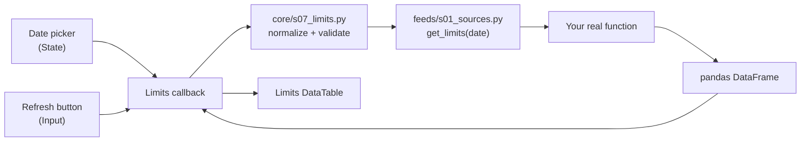

# Archived Example: Add a Limits Page

> **Archived design example — do not paste this guide into Rebirth unchanged.**
> It was written for an earlier router whose active second page was Intraday
> Cashflows. Rebirth currently mounts **Risk** and **Static Data**. Treat the
> snippets below as a layering example only, inspect the live IDs and callback
> owners in `ui/s09_factory.py` and `ui/s07_events.py`, and derive route paths
> from the configured request prefix. The retained cashflow modules are tested
> extension points, not a registered page in the current app.

This guide shows how to add a third page called **Limits** to this Dash
application.

The finished page will:

- appear in the top navigation beside **Risk** and **Intraday Cashflows**;
- contain a date picker;
- contain a **Refresh** button;
- call your own Python function only when **Refresh** is clicked;
- pass the selected date into that function;
- expect the function to return a pandas `DataFrame`;
- display whatever columns that `DataFrame` contains; and
- retain the last successful table if a later refresh fails.

The existing app uses its own small router built around `dcc.Location`. It does
not use Dash Pages, so this guide follows the existing architecture instead of
introducing a second routing system.

## 1. Understand the five parts



Each file has one responsibility:

| File | Responsibility |
|---|---|
| `feeds/s01_sources.py` | Calls your real data source and returns a `DataFrame`. |
| `core/s07_limits.py` | Defines the connector contract, normalizes the date, and validates the result. |
| `ui/s10_limits.py` | Defines the visible page elements. It does not load data. |
| `ui/s07_events.py` | Defines what happens when the user clicks **Refresh** and switches pages. |
| `ui/s09_factory.py` | Adds the page to the app, navigation, and callback wiring. |
| `s01_app.py` | Connects the production `get_limits` function to the app factory. |

The important Dash distinction is:

- an `Input` triggers a callback;
- a `State` supplies a value without triggering it.

The Refresh button is therefore an `Input`, while the chosen date is `State`.
Changing the date alone will not call your function.

## 2. Create the core contract

Create a new file:

```text
core/s07_limits.py
```

Add:

```python
"""Date normalization and validation for the Limits page."""

from __future__ import annotations

from datetime import date, datetime
from typing import Protocol, runtime_checkable

import pandas as pd


class LimitsSchemaError(ValueError):
    """Raised when the Limits connector returns an invalid table."""


@runtime_checkable
class LimitsLoader(Protocol):
    """Return the Limits table for one normalized date."""

    def __call__(self, limits_date: pd.Timestamp, /) -> pd.DataFrame: ...


def normalize_limits_date(
    value: date | datetime | str | pd.Timestamp,
) -> pd.Timestamp:
    """Return a timezone-naive midnight Timestamp for the connector."""
    if isinstance(value, bool):
        raise TypeError("limits_date must be date-like, not boolean")

    try:
        selected = pd.Timestamp(value)
    except (TypeError, ValueError) as error:
        raise ValueError("limits_date is invalid") from error

    if pd.isna(selected):
        raise ValueError("limits_date must not be blank")
    if selected.tzinfo is not None:
        selected = selected.tz_localize(None)
    return selected.normalize()


def validate_limits(frame: pd.DataFrame) -> pd.DataFrame:
    """Validate a connector result and return a defensive copy."""
    if not isinstance(frame, pd.DataFrame):
        raise TypeError("limits loader must return a pandas DataFrame")

    # DataTable column IDs are strings. Converting here gives the whole page one
    # consistent contract and also detects collisions such as 1 and "1".
    column_names = [str(column) for column in frame.columns]
    column_index = pd.Index(column_names)
    duplicate_columns = (
        column_index[column_index.duplicated()].unique().tolist()
    )
    if duplicate_columns:
        raise LimitsSchemaError(
            f"limits contain duplicate columns: {duplicate_columns}"
        )

    result = frame.copy(deep=True)
    result.columns = column_names
    return result


def load_limits(
    loader: LimitsLoader,
    limits_date: date | datetime | str | pd.Timestamp,
) -> pd.DataFrame:
    """Call the connector once for one date and validate its result."""
    if not callable(loader):
        raise TypeError("limits loader must be callable")

    selected_date = normalize_limits_date(limits_date)
    return validate_limits(loader(selected_date))


__all__ = [
    "LimitsLoader",
    "LimitsSchemaError",
    "load_limits",
    "normalize_limits_date",
    "validate_limits",
]
```

Why have this file?

- It keeps validation independent from Dash, so it is easy to test.
- It guarantees your real function receives a clean midnight
  `pd.Timestamp`.
- It prevents a malformed result from replacing a previously successful table.
- It makes a defensive copy, so the display code cannot mutate connector-owned
  data.

This first version deliberately permits any uniquely named columns. Once the
real Limits schema is stable, add a `LIMITS_COLUMNS` tuple and validate the exact
column names and types, following `core/s06_cashflow.py`.

## 3. Add the Limits connector

Open:

```text
feeds/s01_sources.py
```

Add this function near `get_intraday_cashflows`:

```python
def get_limits(limits_date: pd.Timestamp) -> pd.DataFrame:
    """Return demo Limits rows for one date.

    Replace only this function body with the real site function.
    """
    selected = _normalized_date(limits_date, parameter="limits_date")

    return pd.DataFrame(
        [
            {
                "As Of": selected,
                "Portfolio": "FAKE_REPLACE_ME - BOOK_A",
                "Measure": "IR Delta",
                "Usage": 725_000.0,
                "Limit": 1_000_000.0,
            },
            {
                "As Of": selected,
                "Portfolio": "FAKE_REPLACE_ME - BOOK_B",
                "Measure": "FX Delta",
                "Usage": 410_000.0,
                "Limit": 800_000.0,
            },
        ]
    )
```

Also add `"get_limits"` to the module's `__all__` list at the bottom:

```python
__all__ = [
    # existing names ...
    "get_limits",
]
```

When your real function is ready, this connector is normally the only function
body you replace:

```python
from your_package import get_your_real_limits


def get_limits(limits_date: pd.Timestamp) -> pd.DataFrame:
    """Adapt the app's date contract to the real source."""
    selected = _normalized_date(limits_date, parameter="limits_date")
    result = get_your_real_limits(selected)
    return result
```

If the real function expects another date representation, adapt it only here:

```python
# Python date
result = get_your_real_limits(selected.date())

# YYYY-MM-DD string
result = get_your_real_limits(selected.strftime("%Y-%m-%d"))
```

Do not call the real function at module import time. It must run inside
`get_limits`, after the user clicks **Refresh**.

## 4. Build the visible page

Create:

```text
ui/s10_limits.py
```

Add:

```python
"""Components for the independently loaded Limits page."""

from __future__ import annotations

from datetime import date

from dash import dash_table, dcc, html


def build_limits_page() -> html.Div:
    """Build the empty Limits page without retrieving data."""
    return html.Div(
        [
            html.Div(
                [
                    html.Div(
                        [
                            html.H2("Limits", className="limits-title"),
                            html.P(
                                "Choose a date, then refresh the Limits table.",
                                className="limits-note",
                            ),
                        ]
                    ),
                    html.Div(
                        [
                            dcc.DatePickerSingle(
                                id="limits-date",
                                date=date.today(),
                                display_format="YYYY-MM-DD",
                                clearable=False,
                            ),
                            html.Button(
                                "Refresh",
                                id="limits-refresh-button",
                                n_clicks=0,
                                type="button",
                                className="limits-refresh-button",
                            ),
                        ],
                        className="limits-actions",
                    ),
                ],
                className="limits-header",
            ),
            html.Div(
                "Choose a date, then press Refresh.",
                id="limits-status",
                className="limits-status",
                role="status",
            ),
            dcc.Loading(
                dash_table.DataTable(
                    id="limits-table",
                    columns=[],
                    data=[],
                    editable=False,
                    filter_action="native",
                    sort_action="native",
                    sort_mode="multi",
                    page_action="native",
                    page_size=50,
                    fixed_rows={"headers": True},
                    style_table={
                        "overflowX": "auto",
                        "maxHeight": "70vh",
                    },
                    style_header={
                        "backgroundColor": "#F3F5F7",
                        "color": "#111111",
                        "fontWeight": "700",
                        "border": "1px solid #D9E0E7",
                    },
                    style_cell={
                        "backgroundColor": "#FFFFFF",
                        "color": "#111111",
                        "border": "1px solid #E5E9ED",
                        "fontFamily": "Inter, Segoe UI, Arial, sans-serif",
                        "fontSize": "12px",
                        "padding": "8px 10px",
                        "textAlign": "left",
                        "whiteSpace": "nowrap",
                    },
                ),
                type="circle",
            ),
        ],
        id="limits-page",
        className="limits-page",
    )


__all__ = ["build_limits_page"]
```

Notice that `build_limits_page()` does not call `get_limits()`. It creates only
the controls and an empty table, so navigating to the page is immediate.

Every component ID must be unique across the entire app, not only within this
page.

## 5. Add the loader and callback

Open:

```text
ui/s07_events.py
```

### 5.1 Add the import

Add:

```python
from core.s07_limits import LimitsLoader, load_limits
```

### 5.2 Extend `register_callbacks`

Find:

```python
def register_callbacks(
    app: Dash,
    refresh_manager: RefreshManagerProtocol | None,
    initial_snapshot: RefreshSnapshotProtocol | None,
    risk_data: pd.DataFrame,
    *,
    intraday_cashflow_loader: IntradayCashflowLoader | None = None,
    route_prefix: str = "/",
    startup_coordinator: StartupCoordinator | None = None,
    pl_enabled: bool = False,
) -> None:
```

Add the new keyword argument:

```python
def register_callbacks(
    app: Dash,
    refresh_manager: RefreshManagerProtocol | None,
    initial_snapshot: RefreshSnapshotProtocol | None,
    risk_data: pd.DataFrame,
    *,
    intraday_cashflow_loader: IntradayCashflowLoader | None = None,
    limits_loader: LimitsLoader | None = None,
    route_prefix: str = "/",
    startup_coordinator: StartupCoordinator | None = None,
    pl_enabled: bool = False,
) -> None:
```

### 5.3 Add the Refresh callback

Add this callback inside `register_callbacks`, after the Intraday Cashflows
callback:

```python
    @app.callback(
        Output("limits-table", "columns"),
        Output("limits-table", "data"),
        Output("limits-status", "children"),
        Input("limits-refresh-button", "n_clicks"),
        State("limits-date", "date"),
        State("app-location", "pathname"),
        prevent_initial_call=True,
    )
    def refresh_limits(_refresh_clicks, selected_date, pathname):
        """Load Limits only after the user explicitly clicks Refresh."""
        if not str(pathname or "").rstrip("/").endswith("/limits"):
            raise PreventUpdate

        if limits_loader is None:
            return [], [], "No Limits connector is configured."

        try:
            frame = load_limits(limits_loader, selected_date)
        except Exception as error:
            app.logger.exception("Limits refresh failed")
            return (
                no_update,
                no_update,
                f"Limits refresh failed: {type(error).__name__}: {error}",
            )

        # Convert missing values and datetime columns into values Dash can
        # serialize safely. The validated connector frame remains untouched.
        display = frame.copy(deep=True)
        for column in display.columns:
            if pd.api.types.is_datetime64_any_dtype(display[column]):
                display[column] = display[column].astype("string")
        display = display.astype(object).where(pd.notna(display), None)

        columns = [
            {"name": column, "id": column}
            for column in display.columns
        ]
        records = display.to_dict("records")
        date_label = pd.Timestamp(selected_date).strftime("%Y-%m-%d")
        status = (
            f"No Limits rows were returned for {date_label}."
            if frame.empty
            else f"Loaded {len(frame):,} Limits rows for {date_label}."
        )
        return columns, records, status
```

Why these callback settings matter:

- only `n_clicks` is an `Input`, so it is the only trigger;
- the date and path are `State`, so reading them does not trigger work;
- `prevent_initial_call=True` stops data loading during app construction;
- `no_update` retains the last successful table when a refresh fails; and
- checking the path prevents a hidden Limits page from doing work.

## 6. Add navigation and routing

Open:

```text
ui/s09_factory.py
```

Do not replace the whole factory. Make the following small additions.

### 6.1 Add imports

```python
from core.s07_limits import LimitsLoader
from .s10_limits import build_limits_page
```

### 6.2 Extend `build_app`

Add `limits_loader`:

```python
def build_app(
    data: pd.DataFrame | None = None,
    refresh_manager: RefreshManagerProtocol | None = None,
    *,
    intraday_cashflow_loader: IntradayCashflowLoader | None = None,
    limits_loader: LimitsLoader | None = None,
    pl_send_config: PLSendConfig | None = None,
    dash_kwargs: Mapping[str, Any] | None = None,
) -> Dash:
```

### 6.3 Build the proxy-aware URL

Find:

```python
cube_href = request_prefix
cashflows_href = f"{request_prefix.rstrip('/')}/intraday-cashflows"
```

Add:

```python
limits_href = f"{request_prefix.rstrip('/')}/limits"
```

Do not hard-code `href="/limits"`. Using `request_prefix` keeps the link working
when Plotly hosts the app behind a URL prefix.

### 6.4 Add the navigation link

Inside the existing `html.Nav`, after the Intraday Cashflows link, add:

```python
dcc.Link(
    "Limits",
    href=limits_href,
    id="limits-nav-link",
    className="app-nav-link cube-nav-link",
),
```

### 6.5 Mount the page container

After `intraday-page-container`, add:

```python
html.Main(
    build_limits_page(),
    id="limits-page-container",
    style={"display": "none"},
),
```

The container remains mounted and is merely hidden when inactive. This keeps
callbacks stable and avoids reconstructing the page on every navigation click.

### 6.6 Pass the loader to callback registration

Find the `register_callbacks(...)` call and add:

```python
limits_loader=limits_loader,
```

For example:

```python
register_callbacks(
    app,
    refresh_manager,
    initial_snapshot,
    risk_data,
    intraday_cashflow_loader=intraday_cashflow_loader,
    limits_loader=limits_loader,
    route_prefix=request_prefix,
    startup_coordinator=startup_coordinator,
    pl_enabled=pl_send_config is not None,
)
```

## 7. Extend the route callback

Return to:

```text
ui/s07_events.py
```

Replace the existing two-page `route_page` callback with:

```python
    @app.callback(
        Output("cube-page-container", "style"),
        Output("intraday-page-container", "style"),
        Output("limits-page-container", "style"),
        Output("cube-nav-link", "className"),
        Output("intraday-nav-link", "className"),
        Output("limits-nav-link", "className"),
        Input("app-location", "pathname"),
    )
    def route_page(pathname):
        """Show one mounted page and mark its navigation link active."""
        normalized = str(pathname or route_prefix).rstrip("/")
        show_cashflows = normalized.endswith("/intraday-cashflows")
        show_limits = normalized.endswith("/limits")
        show_risk = not show_cashflows and not show_limits
        base_class = "app-nav-link cube-nav-link"

        return (
            {} if show_risk else {"display": "none"},
            {} if show_cashflows else {"display": "none"},
            {} if show_limits else {"display": "none"},
            f"{base_class} is-active" if show_risk else base_class,
            f"{base_class} is-active" if show_cashflows else base_class,
            f"{base_class} is-active" if show_limits else base_class,
        )
```

Dash matches returned values to Outputs by position. This callback therefore
returns:

1. Risk page style;
2. Intraday Cashflows page style;
3. Limits page style;
4. Risk navigation class;
5. Intraday Cashflows navigation class; and
6. Limits navigation class.

An unknown URL falls back to the Risk page.

## 8. Connect the production app

Open:

```text
s01_app.py
```

Add `get_limits` to the existing feed imports:

```python
from feeds.s01_sources import (
    build_production_refresh_manager,
    get_intraday_cashflows,
    get_limits,
    send_portfolio_pl,
    send_sog_pl,
)
```

Then pass it into `build_app`:

```python
return build_app(
    refresh_manager=manager,
    intraday_cashflow_loader=get_intraday_cashflows,
    limits_loader=get_limits,
    pl_send_config=pl_send_config,
    dash_kwargs=settings.dash_kwargs,
)
```

This is dependency injection: the UI knows only that it receives a callable
matching `LimitsLoader`. It does not know whether that callable uses SQL, an
API, a CSV file, or another Python library.

No `__init__.py` files need to change.

## 9. Optional page styling

The page works without extra CSS. To give it a layout consistent with the app,
append this to:

```text
assets/s01_style.css
```

```css
.limits-page {
  width: min(100%, 1680px);
  margin: 16px auto 40px;
  padding: 24px;
}

.limits-header {
  display: flex;
  align-items: center;
  justify-content: space-between;
  gap: 12px;
}

.limits-title {
  margin: 0;
  color: var(--text);
}

.limits-note,
.limits-status {
  color: var(--text-muted);
  font-size: 12px;
}

.limits-actions {
  display: flex;
  align-items: center;
  gap: 12px;
}

.limits-status {
  margin: 14px 0 10px;
  font-weight: 700;
}

.limits-refresh-button {
  min-height: 36px;
  padding: 8px 14px;
  border: 1px solid #111111;
  border-radius: 8px;
  background: #111111;
  color: #FFFFFF;
  font-weight: 800;
  cursor: pointer;
}

@media (max-width: 760px) {
  .limits-header {
    align-items: flex-start;
    flex-direction: column;
  }
}
```

## 10. Add focused tests

Create:

```text
tests/s15_limits.py
```

Add:

```python
"""Limits page contract tests."""

from __future__ import annotations

import pandas as pd
import pytest

from core.s07_limits import LimitsSchemaError, load_limits
from ui.s10_limits import build_limits_page


def _component_ids(component) -> set[str]:
    """Collect IDs from one Dash component tree."""
    found: set[str] = set()
    stack = [component]

    while stack:
        current = stack.pop()
        component_id = getattr(current, "id", None)
        if component_id is not None:
            found.add(str(component_id))

        children = getattr(current, "children", None)
        if isinstance(children, (list, tuple)):
            stack.extend(children)
        elif children is not None and not isinstance(children, str):
            stack.append(children)

    return found


def test_limits_loader_normalizes_date_and_calls_connector_once() -> None:
    calls: list[pd.Timestamp] = []
    source = pd.DataFrame([{"Portfolio": "BOOK_A", "Limit": 100.0}])

    def loader(selected_date: pd.Timestamp) -> pd.DataFrame:
        calls.append(selected_date)
        return source

    result = load_limits(loader, "2026-07-24T18:30:00+01:00")

    assert calls == [pd.Timestamp("2026-07-24")]
    assert result.equals(source)
    assert result is not source


def test_limits_loader_rejects_invalid_results() -> None:
    with pytest.raises(TypeError, match="DataFrame"):
        load_limits(lambda _date: ["not", "a", "frame"], "2026-07-24")

    duplicate = pd.DataFrame([[1, 2]], columns=[1, "1"])
    with pytest.raises(LimitsSchemaError, match="duplicate columns"):
        load_limits(lambda _date: duplicate, "2026-07-24")


def test_limits_page_contains_all_callback_components() -> None:
    component_ids = _component_ids(build_limits_page())

    assert {
        "limits-page",
        "limits-date",
        "limits-refresh-button",
        "limits-status",
        "limits-table",
    }.issubset(component_ids)
```

Run:

```powershell
python -m pytest tests/s15_limits.py -q
python -m pytest -q
python -m ruff check .
python -m ruff format --check .
```

## 11. Run and verify the page

Start the app using the same command you normally use, then verify:

1. The existing Risk page renders normally.
2. **Limits** appears in the top navigation.
3. Clicking **Limits** changes the URL to `/limits`.
4. The empty page appears without calling the connector.
5. Changing the date does not load data.
6. Clicking **Refresh** calls `get_limits` exactly once.
7. The returned columns and rows appear in the table.
8. Sorting and filtering work.
9. A connector error appears in the status text and retains the last successful
   table.
10. Opening `/limits` directly works locally and on Plotly.

## 12. Common problems

### The page appears, but the table never loads

Check all three wiring points:

```python
# s01_app.py
limits_loader=get_limits

# ui/s09_factory.py
limits_loader=limits_loader

# ui/s07_events.py
limits_loader: LimitsLoader | None = None
```

Also check that these IDs match exactly in the layout and callback:

```text
limits-date
limits-refresh-button
limits-status
limits-table
```

### Selecting a date immediately calls the function

The date was probably declared as an `Input`. It must be:

```python
State("limits-date", "date")
```

The Refresh button should be the only callback `Input`.

### The function runs while the app starts

Search for `get_limits(`. It should be called only through:

```python
load_limits(limits_loader, selected_date)
```

inside the Refresh callback. Do not call it while defining the layout, creating
the app, or importing the feed module.

### The callback says a component does not exist

Dash component IDs are global. Confirm the page container is always mounted in
`serve_layout()` and that no other page uses the same IDs.

### The table loses its old rows after an error

The error branch must return `no_update` for both table Outputs:

```python
return no_update, no_update, "Limits refresh failed ..."
```

Returning `[]` clears the table.

### It works locally but the navigation link fails on Plotly

Construct the URL from `request_prefix`:

```python
limits_href = f"{request_prefix.rstrip('/')}/limits"
```

Do not hard-code the hosted path.

## 13. How to add more elements later

Adding an element means doing two things:

1. create the visible component in `ui/s10_limits.py`; and
2. add it to a callback as an `Input`, `State`, or `Output`.

For example, to add a Portfolio filter:

```python
# ui/s10_limits.py
dcc.Dropdown(
    id="limits-portfolio",
    options=[],
    placeholder="All portfolios",
)
```

Then read it without triggering a data retrieval:

```python
@app.callback(
    Output("limits-table", "columns"),
    Output("limits-table", "data"),
    Output("limits-status", "children"),
    Input("limits-refresh-button", "n_clicks"),
    State("limits-date", "date"),
    State("limits-portfolio", "value"),
    State("app-location", "pathname"),
    prevent_initial_call=True,
)
def refresh_limits(
    _refresh_clicks,
    selected_date,
    selected_portfolio,
    pathname,
):
    ...
```

If the Portfolio selection itself should immediately refresh the table, make it
an `Input` instead. For expensive database or API calls, keeping it as `State`
and requiring the Refresh button is usually safer.

## Final ownership rule

After the scaffold is in place, a site owner should normally replace only:

```python
def get_limits(limits_date: pd.Timestamp) -> pd.DataFrame:
    return your_real_limits_function(limits_date)
```

The remaining code owns date normalization, validation, routing, error
retention, and display behavior.
