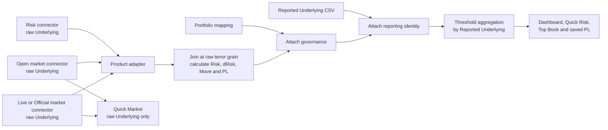

# Connections

This guide records the `Reported Underlying` connection added to Cube and shows
exactly what was added, what was changed, and what was deliberately left alone.
It is written so the same change can be copied manually into another checkout.

## What the change does

The risk and market connectors continue to use the raw `Underlying`. A separate
CSV maps that raw identity to a reporting identity after market joins and P&L
calculation:

```text
Risk Type + Risk Greek + Underlying -> Reported Underlying
```

For example:

```csv
Risk Type,Risk Greek,Underlying,Reported Underlying
IR,Delta,CNY,CNx
IR,Delta,CNO,CNx
```

`CNY` and `CNO` therefore keep their own market curves and P&L calculations,
but the dashboard can show their final values together beneath `CNx`.



The important order is:

1. Load risk using the raw `Underlying`.
2. Load Open and Live/Official market data using that same raw `Underlying`.
3. Join the risk and market tenors.
4. Calculate `Move` and `PL` per raw underlying.
5. Add portfolio metadata.
6. Attach `Reported Underlying`.
7. Aggregate reporting views and thresholds.

Do not map `CNY` and `CNO` to `CNx` before step 4. They may have different
market curves. For example, `10 × 1 + 10 × 2 = 30`; applying one shared `CNx`
move before P&L would not preserve that answer.

## Files added

| File | Purpose |
|---|---|
| `core/s06_reporting.py` | Loads, validates, and attaches the reporting mapping without altering raw data. |
| `data/s09_reported.csv` | Four-column CSV contract and replaceable demo rows. |
| `tests/s14_reporting.py` | Tests schema validation, identity fallback, many-to-one aggregation, thresholds, and separation of Quick Risk from Quick Market. |

No files were deleted.

## Files changed

| File | Functions or areas changed | Reason |
|---|---|---|
| `feeds/s01_sources.py` | Fake-data inventory, `get_reported_underlyings()`, `build_production_refresh_manager()` and `__all__` | Exposes the CSV as a lazy governance connector and passes it to the refresh manager. |
| `core/s02_pipeline.py` | `load_reported_underlyings()`, `_apply_validated_thresholds()`, `to_dashboard_frame()`, `_validate_dashboard_release()`, `build_dashboard_dataframe()`, `RiskRefreshManager.__init__()`, `_release_pl_views()`, `refresh_portfolios()`, refresh commit path and `__all__` | Loads the map, applies it after P&L, carries both identities, aggregates thresholds at reporting grain, and commits the result atomically. |
| `core/s03_search.py` | Search constants, exact-key construction, catalog positions, risk/market pivot validation and hierarchy construction | Makes Quick Risk select a reported identity while Quick Market remains keyed by the real raw market identity. |
| `ui/s02_constants.py` | `BASE_GROUPS` and `TOP_EXPOSURE_GROUPS` | Adds `reported underlying` above raw `underlying` in the hierarchy. |
| `ui/s03_aggregate.py` | Frame preparation, sort order, hierarchy construction, market-value visibility and promoted-row scoping | Supports `CNx -> CNY/CNO`, removes duplicate one-to-one levels, and prevents a fictional market value being shown at a many-to-one parent. |
| `ui/s04_components.py` | Quick-search defaults/options, Top Book aggregation, hierarchy labels, Raw Data and Unmapped Books | Displays and exposes both the reporting and raw identities where appropriate. |
| `ui/s07_events.py` | Quick Market callback | Gives Quick Market its own raw-underlying index instead of reusing the Quick Risk default. |
| `tests/s06_ui.py` | Quick Risk default-index assertion | Covers the new `Reported Underlying -> Underlying -> tenor` default hierarchy. |
| `README.md` | Architecture, schema, refresh, search and fake-data sections | Documents the new contract and behavior. |

## What was not changed

The following were deliberately not changed:

- Risk connector logic.
- Open or Live/Official market connector logic.
- Product adapters.
- Per-underlying market loops or batch behavior.
- Multipliers.
- P&L formulas.
- Raw `Underlying` values.
- Market tenor order.
- Connector-supplied `Group` values.
- The rule that market status decides whether Current means Live or Official.

`Group` is still authoritative from the risk connector. The reporting CSV does
not validate, calculate, or overwrite it.

## CSV contract

The file must have exactly these columns in exactly this order:

```csv
Risk Type,Risk Greek,Underlying,Reported Underlying
```

Rules:

- Every cell must contain non-blank text.
- Leading and trailing spaces are removed.
- `Risk Type + Risk Greek + Underlying` must be unique.
- Multiple source rows may share one `Reported Underlying`.
- `Risk Type + Risk Greek` must already be a registered product pair.
- An unmapped row uses its raw `Underlying` as `Reported Underlying`.
- A header-only CSV is valid and means that every row uses identity fallback.
- Mapping is exact and non-recursive. A target such as `CNx` is not mapped again.
- Applying the mapping to a frame that already has `Reported Underlying` is
  rejected, which prevents accidental double mapping.

The checked-in file contains obvious `FAKE_REPLACE_ME` rows. Replace them with
real identities:

```csv
Risk Type,Risk Greek,Underlying,Reported Underlying
IR,Delta,CNY,CNx
IR,Delta,CNO,CNx
FX,Delta,EURUSD,G10 FX
FX,Delta,GBPUSD,G10 FX
```

The same raw label can have a different target for another product:

```csv
Risk Type,Risk Greek,Underlying,Reported Underlying
IR,Delta,CNY,CNx
IR,Vega,CNY,CN Vol
FX,Delta,CNY,CN FX
```

## Manual implementation

### 1. Add the reporting module

Copy `core/s06_reporting.py` in full. Its two public functions are:

```python
load_reported_underlying_mapping(
    source,
    *,
    allowed_pairs=None,
) -> pd.DataFrame
```

This reads and validates the exact CSV contract.

```python
attach_reported_underlying(
    frame,
    mapping,
    *,
    allowed_pairs=None,
) -> pd.DataFrame
```

This leaves every existing row and raw value unchanged, inserts
`Reported Underlying` immediately after `Underlying`, and falls back to raw
`Underlying` when no mapping exists.

### 2. Add the CSV

Create `data/s09_reported.csv`:

```csv
Risk Type,Risk Greek,Underlying,Reported Underlying
```

Add the real mappings below the header.

### 3. Add the source connector

In `feeds/s01_sources.py`, add the path and loader. For a real local CSV:

```python
from pathlib import Path

REPORTED_UNDERLYING_PATH = (
    Path(__file__).resolve().parent.parent / "data" / "s09_reported.csv"
)


def get_reported_underlyings() -> pd.DataFrame:
    return pd.read_csv(
        REPORTED_UNDERLYING_PATH,
        dtype="string",
        encoding="utf-8-sig",
        keep_default_na=False,
    )
```

The checked-in public demo instead registers `reported_underlyings` in
`FAKE_DATA_FILES` and reads it through `_read_fake_csv()`. In a private/live
copy, replace only the body of `get_reported_underlyings()` with the real source.

Pass the function itself, not its result, when building the manager:

```python
return RiskRefreshManager(
    # existing arguments...
    reported_underlyings=get_reported_underlyings,
)
```

Passing the callable keeps application construction free of source I/O. The CSV
is read during a refresh, when errors can be shown by the refresh framework.
Existing custom manager constructions can omit this optional argument and keep
one-to-one identity fallback.

### 4. Connect it to the pipeline

At the top of `core/s02_pipeline.py`:

```python
from core.s06_reporting import (
    REPORTED_UNDERLYING,
    attach_reported_underlying,
    load_reported_underlying_mapping,
)
```

Add `reported_underlyings` to `RiskRefreshManager.__init__()`:

```python
def __init__(
    self,
    product_sources,
    multipliers,
    config,
    *,
    thresholds=None,
    reported_underlyings=None,
    # existing keyword arguments...
):
    self._reported_underlying_source = reported_underlyings
    self._reported_underlyings = (
        None
        if callable(reported_underlyings)
        else load_reported_underlyings(reported_underlyings)
    )
```

The production code also uses the wrapper below so registered product pairs are
validated:

```python
def load_reported_underlyings(source):
    if source is None:
        return load_reported_underlying_mapping(
            None,
            allowed_pairs=_PRODUCT_PAIRS,
        )
    resolved = _load_governance_source(
        source,
        label="Reported Underlying mapping",
    )
    return load_reported_underlying_mapping(
        resolved,
        allowed_pairs=_PRODUCT_PAIRS,
    )
```

### 5. Apply it after P&L

In `RiskRefreshManager._release_pl_views()`, the order must be:

```python
combined = pd.concat(
    [pl_frames[source_type] for source_type in PRODUCT_SPECS_BY_SOURCE_TYPE],
    ignore_index=True,
    sort=False,
)

configured = _merge_validated_config(combined, config)

reported = attach_reported_underlying(
    configured,
    reported_underlyings,
    allowed_pairs=_PRODUCT_PAIRS,
)

enriched = _apply_validated_thresholds(reported, thresholds)
```

The same order is used by the one-shot `build_dashboard_dataframe()` helper:

```python
configured = merge_config(
    build_all_pl(
        product_sources,
        multipliers,
        risk_dates,
        market_date=market_date,
        market_status=market_status,
    ),
    config,
)

reported = attach_reported_underlying(
    configured,
    reported_underlyings,
    allowed_pairs=_PRODUCT_PAIRS,
)

enriched = apply_thresholds(reported, thresholds)
```

### 6. Aggregate thresholds at reporting grain

In `_apply_validated_thresholds()` use:

```python
if REPORTED_UNDERLYING not in result:
    result[REPORTED_UNDERLYING] = result[UNDERLYING]

keys = [RISK_TYPE, RISK_GREEK, REPORTED_UNDERLYING]
```

When a total is promoted, use the reporting identity:

```python
aggregate[DISPLAY_BUCKET] = np.where(
    aggregate[PROMOTION_REASON].ne(""),
    aggregate[REPORTED_UNDERLYING],
    "Other",
)
```

This means `CNY` and `CNO` can jointly cross a threshold as `CNx`.

### 7. Keep both identities in released data

Add `REPORTED_UNDERLYING` alongside `UNDERLYING` in:

- `to_dashboard_frame()`
- `_validate_dashboard_release()`
- any explicit saved-P&L or export column allowlist

The final data therefore keeps both:

```text
Reported Underlying = CNx
Underlying          = CNY
```

and:

```text
Reported Underlying = CNx
Underlying          = CNO
```

### 8. Reload and commit it transactionally

Load the callable during refresh:

```python
next_reported_underlyings = load_reported_underlyings(
    self._reported_underlying_source
)
```

Pass the loaded frame to `_release_pl_views()`, and only assign:

```python
self._reported_underlyings = next_reported_underlyings
```

inside the same locked commit that publishes the new snapshot.

`Refresh Portfolios` reloads:

- the dated portfolio mapping;
- the `Reported Underlying` mapping;
- all dependent dashboard and search views.

It does not recall risk, market, checker, or threshold connectors.

A normal Risk/PL refresh also reloads the reporting mapping whenever it builds
and commits a new full snapshot. If a refresh fails, the previous successful
snapshot and mapping remain visible.

### 9. Separate Quick Risk from Quick Market

In `core/s03_search.py`:

```python
REPORTED_UNDERLYING = "Reported Underlying"
```

Build the Quick Risk exact key from:

```text
Risk Type | Risk Greek | Reported Underlying
```

Build Quick Market from:

```text
Risk Type | Risk Greek | Underlying
```

`Reported Underlying` is a risk-only index field and is rejected by Quick
Market rather than being silently treated as a real quote identity.

When `IR | Delta | CNx` is selected in Quick Risk, collect all raw risk rows
under that reporting identity. Market values must then be matched using those
rows' real `Underlying` values, such as `CNY` and `CNO`.

At a many-to-one `CNx` parent:

- `Risk`, `dRisk`, and `PL` may be summed.
- `Open`, `Current`, and `Move` must be blank.

At the raw `CNY` and `CNO` children:

- their own `Open`, `Current`, and `Move` may be shown.

This avoids inventing a market quote for `CNx`.

### 10. Update the UI hierarchy

In `ui/s02_constants.py`:

```python
BASE_GROUPS = [
    "risk greek",
    "display bucket",
    "reported underlying",
    "group",
    "underlying",
    "tenor swap",
    "tenor option",
    "split",
    DEFAULT_VIEW_DIMENSION,
]

TOP_EXPOSURE_GROUPS = [
    "label",
    "risk type",
    "risk greek",
    "reported underlying",
]
```

In `ui/s04_components.py`:

```python
QUICK_SEARCH_DEFAULT_INDEX = (
    "Reported Underlying",
    "Underlying",
    "Tenor Swap",
    "Tenor Option",
)

QUICK_MARKET_DEFAULT_INDEX = (
    "Underlying",
    "Tenor Swap",
    "Tenor Option",
)
```

Expose both columns in Raw Data and Unmapped Books. Top Book should aggregate
and label `Reported Underlying`.

In `ui/s07_events.py`, make the Quick Market callback explicitly use
`QUICK_MARKET_DEFAULT_INDEX`.

### 11. Add tests

Copy `tests/s14_reporting.py` and update the Quick Risk default assertion in
`tests/s06_ui.py`.

The focused tests prove:

- exact headers and header order;
- whitespace normalization and blank rejection;
- duplicate source-key rejection;
- repeated target acceptance;
- product-specific scoping;
- identity fallback for unmapped rows;
- preservation of raw rows and values;
- post-P&L `CNY + CNO -> CNx` aggregation;
- threshold promotion at `CNx`;
- reported Quick Risk with raw Quick Market.

## Expected refresh behavior

| Action | Risk connectors | Market connectors | Portfolio mapping | Reporting CSV | Dependent views |
|---|---:|---:|---:|---:|---:|
| Initial/full Risk refresh | Yes | Yes | Yes | Yes | Rebuilt |
| Refresh PL | No risk reload unless required by existing rules | Current market path | Cached unless existing date rules reload it | Reloaded when the full snapshot is rebuilt | Rebuilt |
| Refresh Portfolios | No | No | Yes | Yes | Rebuilt |

The reporting map is lazy: it is not read merely because the web application
module was imported or the page shell rendered.

## Publishing and generated fixtures

No Plotly publishing code needed to change. The existing deployment bundler
copies the complete `core/`, `data/`, `feeds/`, and `ui/` directories, so the
new module and CSV are included automatically.

`tools/s01_fixtures.py` does not currently generate `data/s09_reported.csv`.
Treat this file as manually governed unless you deliberately extend the fixture
generator. This is the same style of exception already used by the PLSEND map.

When copying the changes manually on Windows, Git may report CRLF-to-LF
normalization for `core/s02_pipeline.py`, `ui/s02_constants.py`, or
`ui/s03_aggregate.py`. That is line-ending noise, not additional feature logic.

## Verification

From the repository root, run:

```powershell
python -m pytest
python -m ruff check .
```

The implementation was checked with:

```text
112 tests passed
Ruff passed
```

The warnings were existing Dash DataTable deprecation warnings, not reporting
mapping failures.

## Fast manual checklist

- [ ] Create `core/s06_reporting.py`.
- [ ] Create `data/s09_reported.csv` with the exact four headers.
- [ ] Add `get_reported_underlyings()` in `feeds/s01_sources.py`.
- [ ] Pass the callable into `RiskRefreshManager`.
- [ ] Load it lazily inside refresh.
- [ ] Attach it after raw P&L and portfolio mapping.
- [ ] Aggregate thresholds by `Reported Underlying`.
- [ ] Keep raw `Underlying` in every released/exported row.
- [ ] Use reported identity for Quick Risk.
- [ ] Use raw identity for Quick Market.
- [ ] Add the reported parent above the raw child in UI hierarchies.
- [ ] Reload it through Refresh Portfolios.
- [ ] Commit it atomically with the snapshot.
- [ ] Add the reporting tests.
