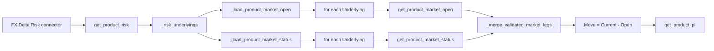

# Connector 2: Bulk FX Market Connector

This guide explains how to make FX Delta request market data for every required
currency pair in one bulk call instead of calling the upstream service once per
pair.

It is a migration guide. The current checked-in framework still uses
per-`Underlying` market hooks until the changes below are implemented.

## The result

Assume validated FX Delta Risk contains:

```text
EUR/USD
USD/JPY
GBP/USD
```

The current full refresh does:

```text
Open(EUR/USD)
Open(USD/JPY)
Open(GBP/USD)

Current(EUR/USD)
Current(USD/JPY)
Current(GBP/USD)
```

That is six connector calls.

The bulk version passes the complete immutable scope:

```python
requested_underlyings = (
    "EUR/USD",
    "USD/JPY",
    "GBP/USD",
)
```

and does either:

```text
one bulk Open call + one bulk Current call
```

or, if one upstream response genuinely contains both fields:

```text
one combined bulk snapshot call
```

No other product needs to become bulk.

## Which implementation should you use?

Use the combined snapshot version if one real function returns both `Open` and
the selected Live/Official value:

```text
Underlying, Open, Current
```

This most closely matches a service that “supplies all the market details in one
go.”

Use the two-leg version if Open and Current come from two independent upstream
endpoints:

```text
bulk Open endpoint    -> one request containing all pairs
bulk Current endpoint -> one request containing all pairs
```

Both versions remove the per-pair loop. The combined version is described first.

## Existing call chain

The existing flow is:



The relevant functions are in `core/s02_pipeline.py`:

| Function or type | Current responsibility |
|---|---|
| `ProductMarketConnector` | Defines a connector receiving one `underlying: str`. |
| `ProductConnectorAdapter` | Holds Risk, one-Underlying Open, and one-Underlying Current hooks. |
| `RiskRefreshManager._risk_underlyings()` | Extracts a stable, first-seen tuple from validated Risk. |
| `RiskRefreshManager._load_product_market_open()` | Loops that tuple and concatenates Open results. |
| `RiskRefreshManager._load_product_market_status()` | Loops that tuple and concatenates Current results. |
| `get_product_market_open()` | Validates the complete Open frame. |
| `get_product_market_status()` | Validates the complete Live/Official frame. |
| `_merge_validated_market_legs()` | Reconciles market keys and derives Move. |
| `get_product_pl()` | Joins Risk to Market and calculates P&L. |

Changing only `feeds/s01_sources.py` does not remove the loops. A function that
fetches every pair but is installed as an ordinary adapter would be invoked once
per pair and could repeat the same expensive request.

## What is already called once?

The market-status resolver is already called once per refresh:

```python
market_status = get_market_state(market_date)
```

It returns exactly:

```text
Live
```

or:

```text
OFFICIAL
```

The bulk connector must use this supplied value. It must not inspect its own
clock and independently guess Live or OFFICIAL.

This bulk-market work is unrelated to RiskChecker. RiskChecker still receives
the checker date and returns its two DataFrames.

## Exact FX Delta shapes

FX Delta is a spot product in the current `PRODUCT_SPECS` catalogue. It has no
tenor axes.

Risk connector:

```text
Underlying, Portfolio, Group, Risk, dRisk
```

Bulk Open connector:

```text
Underlying, Open
```

Bulk Current connector:

```text
Underlying, Current
```

Combined bulk snapshot:

```text
Underlying, Open, Current, Market Status
```

Rules:

- One row per raw `Underlying`.
- `Open` and `Current` must be finite numeric values.
- Do not add `Tenor Swap`, `Tenor Option`, or tenor-order fields to FX Delta.
- The UI later displays the spot identity; the connector does not invent a tenor.
- `Market Status` must exactly equal the manager argument on every row.
- Do not return numeric columns called `Live` or `OFFICIAL`.
- Do not return `Reported Underlying`; it is attached after P&L.
- Do not return an aggregated reporting identity such as `G10 FX`.
- Keep the connector’s canonical raw currency-pair spelling consistent with Risk.

## Recommended design: one combined bulk snapshot

Use a separate adapter type. This is clearer and safer than putting tuple and
string behavior behind the same callable.

### Step 1: add an explicit bulk protocol

In `core/s02_pipeline.py`, beside `ProductMarketConnector`, add:

```python
class ProductBulkMarketConnector(Protocol):
    """One source-bound market snapshot for all validated Risk Underlyings."""

    def __call__(
        self,
        market_date: pd.Timestamp,
        underlyings: tuple[str, ...],
        *,
        market_status: str,
    ) -> pd.DataFrame: ...
```

Do not use `str | tuple[str, ...]` in the ordinary connector. Separate types
make it impossible to silently call a bulk function with one string.

### Step 2: add a separate bulk adapter

In the same file:

```python
@dataclass(frozen=True)
class BulkProductConnectorAdapter:
    """Risk plus one complete Open/Current market snapshot."""

    risk: Callable[[pd.Timestamp], pd.DataFrame]
    market_snapshot: ProductBulkMarketConnector
```

The ordinary adapter stays unchanged:

```python
@dataclass(frozen=True)
class ProductConnectorAdapter:
    risk: Callable[[pd.Timestamp], pd.DataFrame]
    market_open: ProductMarketConnector
    market_status: ProductMarketConnector
```

This prevents invalid combinations such as providing an ordinary Open hook and
a combined bulk snapshot at the same time.

### Step 3: update manager adapter validation

`RiskRefreshManager.__init__()` currently accepts only
`ProductConnectorAdapter`. Change the annotation:

```python
ConnectorAdapter = ProductConnectorAdapter | BulkProductConnectorAdapter


def __init__(
    self,
    config,
    *,
    # existing arguments...
    connector_adapters: Mapping[str, ConnectorAdapter] | None = None,
):
    ...
```

Validate the two types explicitly:

```python
for source_type, adapter in adapters.items():
    if isinstance(adapter, ProductConnectorAdapter):
        hooks = ("risk", "market_open", "market_status")
    elif isinstance(adapter, BulkProductConnectorAdapter):
        hooks = ("risk", "market_snapshot")
    else:
        raise TypeError(
            f"connector adapter for {source_type!r} must be a "
            "ProductConnectorAdapter or BulkProductConnectorAdapter"
        )

    invalid_hooks = [
        hook for hook in hooks if not callable(getattr(adapter, hook, None))
    ]
    if invalid_hooks:
        raise TypeError(
            f"connector adapter for {source_type!r} has non-callable hooks: "
            f"{invalid_hooks}"
        )
```

Do not detect bulk mode by inspecting a function name or signature.

### Step 4: add a combined-frame validator

In `core/s02_pipeline.py`, add:

```python
def get_product_market_snapshot(
    spec: ProductSpec,
    market_date: date | datetime | str | pd.Timestamp,
    source: FrameSource,
    *,
    market_status: str,
) -> tuple[pd.DataFrame, pd.DataFrame]:
    """Validate one combined response using the existing leg validators."""

    selected_date = _as_timestamp(market_date)
    selected_status = _require_market_status(market_status)
    raw = _load_frame(
        source,
        label=f"{spec.key} bulk market snapshot",
        allow_empty=True,
    )

    # Each validator selects its own canonical columns from the shared response.
    validated_open = get_product_market_open(
        spec,
        selected_date,
        raw,
    )
    validated_current = get_product_market_status(
        spec,
        selected_date,
        raw,
        market_status=selected_status,
    )
    return validated_open, validated_current
```

This deliberately reuses the existing validation:

- product identity;
- required keys;
- finite numeric quotes;
- unique market keys;
- market-owned tenor ranks for non-FX products;
- exact Live/OFFICIAL status.

Do not create a second weaker validation path for bulk data.

### Step 5: add a manager loader that calls once

In `RiskRefreshManager`:

```python
def _load_product_market_snapshot(
    self,
    spec: ProductSpec,
    market_date: pd.Timestamp,
    underlyings: tuple[str, ...],
    *,
    market_status: str,
) -> pd.DataFrame:
    adapter = self._connector_adapters.get(spec.source_type)
    if not isinstance(adapter, BulkProductConnectorAdapter):
        raise TypeError(f"{spec.source_type!r} is not configured for bulk market")

    selected_status = _require_market_status(market_status)
    self._progress_activity(
        _callable_name(adapter.market_snapshot),
        "market_bulk",
        source_type=spec.source_type,
        product_total=len(underlyings),
        message=(
            f"Loading one bulk market snapshot for "
            f"{len(underlyings)} Underlyings."
        ),
    )

    frame = adapter.market_snapshot(
        market_date,
        underlyings,
        market_status=selected_status,
    )
    if not isinstance(frame, pd.DataFrame):
        raise TypeError(
            "bulk market snapshot connector must return a pandas DataFrame"
        )
    return frame
```

The connector receives one tuple, so three pairs produce one invocation.

### Step 6: use a refresh-scoped cache

One combined response is needed by both the Open and Current stages. Cache it
only inside the active refresh transaction:

```python
bulk_market_cache: dict[
    str,
    tuple[pd.DataFrame, pd.DataFrame],
] = {}
```

Add a local helper inside the refresh market section:

```python
def get_bulk_legs(
    spec: ProductSpec,
    requested_underlyings: tuple[str, ...],
) -> tuple[pd.DataFrame, pd.DataFrame]:
    source_type = spec.source_type
    cached = bulk_market_cache.get(source_type)
    if cached is not None:
        return cached

    raw = self._load_product_market_snapshot(
        spec,
        market_date,
        requested_underlyings,
        market_status=expected_market_status,
    )
    validated_open, validated_current = get_product_market_snapshot(
        spec,
        market_date,
        raw,
        market_status=expected_market_status,
    )
    self._reject_unrequested_market_underlyings(
        validated_open,
        requested_underlyings,
        label=f"{spec.key} bulk market Open",
    )
    self._reject_unrequested_market_underlyings(
        validated_current,
        requested_underlyings,
        label=f"{spec.key} bulk market Current",
    )
    bulk_market_cache[source_type] = (
        validated_open,
        validated_current,
    )
    return bulk_market_cache[source_type]
```

In the existing Open loop:

```python
adapter = self._connector_adapters.get(source_type)

if isinstance(adapter, BulkProductConnectorAdapter):
    validated_open, _ = get_bulk_legs(spec, requested_underlyings)
else:
    raw_open = self._load_product_market_open(
        spec,
        market_date,
        requested_underlyings,
        market_status=expected_market_status,
    )
    validated_open = get_product_market_open(
        spec,
        market_date,
        raw_open,
    )

next_open[source_type] = validated_open
```

In the existing Current loop:

```python
adapter = self._connector_adapters.get(source_type)

if isinstance(adapter, BulkProductConnectorAdapter):
    _, validated_current = get_bulk_legs(spec, requested_underlyings)
else:
    raw_current = self._load_product_market_status(
        spec,
        market_date,
        requested_underlyings,
        market_status=expected_market_status,
    )
    validated_current = get_product_market_status(
        spec,
        market_date,
        raw_current,
        market_status=expected_market_status,
    )

next_status[source_type] = validated_current
```

Behavior:

- A full Risk refresh needs Open and Current, but the connector is called once.
- Refresh PL normally needs only Current, so the connector is called once again
  and the newly validated Current is committed.
- During Current-only Refresh PL, retain the already committed Open rather than
  replacing it merely because the response also contained an Open column.
- The cache disappears when that refresh finishes.
- A failed call or validation never publishes a partial result.

Do not put this cache at module level and do not use `functools.lru_cache`.

### Step 7: add the strict FX bulk adapter

Create `adapters/s05_fx.py`:

```python
from __future__ import annotations

from typing import Protocol, Sequence

import pandas as pd

from adapters.s01_common import RiskSource, exact_frame, exact_status
from core.s02_pipeline import BulkProductConnectorAdapter


FX_DELTA_RISK = (
    "Underlying",
    "Portfolio",
    "Group",
    "Risk",
    "dRisk",
)
FX_DELTA_SOURCE_SNAPSHOT = (
    "Underlying",
    "Open",
    "Current",
)
FX_DELTA_SNAPSHOT = (
    *FX_DELTA_SOURCE_SNAPSHOT,
    "Market Status",
)


class BulkSnapshotSource(Protocol):
    def __call__(
        self,
        market_date: pd.Timestamp,
        underlyings: tuple[str, ...],
        *,
        market_status: str,
    ) -> pd.DataFrame: ...


def _requested_scope(values: Sequence[str]) -> tuple[str, ...]:
    if isinstance(values, (str, bytes)):
        raise TypeError("underlyings must be a sequence, not one string")

    requested = tuple(
        value.strip() if isinstance(value, str) else ""
        for value in values
    )
    if not requested or any(not value for value in requested):
        raise ValueError("underlyings must contain nonblank text")

    duplicated = (
        pd.Index(requested)[pd.Index(requested).duplicated()]
        .unique()
        .tolist()
    )
    if duplicated:
        raise ValueError(
            f"requested underlyings contain duplicates: {duplicated}"
        )
    return requested


def _checked_bulk_snapshot(
    source: BulkSnapshotSource,
    market_date: pd.Timestamp,
    underlyings: Sequence[str],
    *,
    market_status: str,
) -> pd.DataFrame:
    requested = _requested_scope(underlyings)
    selected_status = exact_status(market_status)

    # This is the one real upstream call.
    frame = exact_frame(
        source(
            market_date,
            requested,
            market_status=selected_status,
        ),
        columns=FX_DELTA_SOURCE_SNAPSHOT,
        label="FX Delta bulk market snapshot",
    )

    values = frame["Underlying"]
    if values.isna().any():
        raise ValueError("FX Delta bulk market returned a null Underlying")
    frame["Underlying"] = values.astype("string").str.strip()
    if frame["Underlying"].eq("").any():
        raise ValueError("FX Delta bulk market returned a blank Underlying")

    duplicate = frame.duplicated(["Underlying"], keep=False)
    if duplicate.any():
        names = (
            frame.loc[duplicate, "Underlying"]
            .drop_duplicates()
            .tolist()
        )
        raise ValueError(
            f"FX Delta bulk market returned duplicate quotes for: {names}"
        )

    requested_set = set(requested)
    actual_set = set(frame["Underlying"])
    missing = [value for value in requested if value not in actual_set]
    unexpected = [
        value
        for value in frame["Underlying"].tolist()
        if value not in requested_set
    ]
    if missing or unexpected:
        raise ValueError(
            "FX Delta bulk market Underlying coverage mismatch; "
            f"missing={missing}, unexpected={unexpected}"
        )

    # Restore the stable order supplied by validated Risk.
    rank = {
        value: position
        for position, value in enumerate(requested)
    }
    frame["__requested_order__"] = frame["Underlying"].map(rank)
    frame = (
        frame.sort_values("__requested_order__", kind="stable")
        .drop(columns="__requested_order__")
        .reset_index(drop=True)
    )
    frame["Market Status"] = selected_status
    return frame[list(FX_DELTA_SNAPSHOT)]


def build_fx_delta_bulk_adapter(
    *,
    risk: RiskSource,
    market_snapshot: BulkSnapshotSource,
) -> BulkProductConnectorAdapter:
    def get_risk(risk_date: pd.Timestamp) -> pd.DataFrame:
        return exact_frame(
            risk(risk_date),
            columns=FX_DELTA_RISK,
            label="FX Delta risk",
        )

    def get_market_snapshot(
        market_date: pd.Timestamp,
        underlyings: tuple[str, ...],
        *,
        market_status: str,
    ) -> pd.DataFrame:
        return _checked_bulk_snapshot(
            market_snapshot,
            market_date,
            underlyings,
            market_status=market_status,
        )

    return BulkProductConnectorAdapter(
        risk=get_risk,
        market_snapshot=get_market_snapshot,
    )
```

The strict example requires one quote for every requested pair. If your desk
wants the current framework’s tolerant missing-market behavior, remove only the
`missing` part of the coverage error. Missing rows will then become:

```text
Market Available = False
Market Data Status = No matching market row
PL = NaN
```

Never replace missing quotes with zero.

### Step 8: write the one-call real source

In `feeds/s01_sources.py`, or in your private connector module:

```python
def get_fx_delta_market_snapshot(
    market_date: pd.Timestamp,
    underlyings: tuple[str, ...],
    *,
    market_status: str,
) -> pd.DataFrame:
    if market_status not in {"Live", "OFFICIAL"}:
        raise ValueError(
            "market_status must be exactly 'Live' or 'OFFICIAL'"
        )

    requested = list(underlyings)

    # ONE upstream request. Pass all requested currency pairs together.
    raw = fx_market_client.read_snapshot(
        date=market_date,
        currency_pairs=requested,
        source=market_status,
        fields=["OPEN", "MID"],
        timeout=20,
    )

    frame = pd.DataFrame(raw).rename(
        columns={
            "currency_pair": "Underlying",
            "opening_quote": "Open",
            "selected_quote": "Current",
        }
    )

    # The service may return its full universe. Return only Risk-requested pairs.
    frame = frame.loc[frame["Underlying"].isin(underlyings)].copy()
    return frame[
        ["Underlying", "Open", "Current"]
    ]
```

Even if the upstream service always returns every currency pair, pass
`underlyings` into this function and filter the result before returning it.

### Step 9: register only FX Delta as bulk

In `feeds/s01_sources.py`, import:

```python
from adapters.s05_fx import build_fx_delta_bulk_adapter
```

After constructing the normal adapter map:

```python
adapters["fx/delta"] = build_fx_delta_bulk_adapter(
    risk=get_real_fx_delta_risk,
    market_snapshot=get_fx_delta_market_snapshot,
)
```

Return the map normally:

```python
return adapters
```

All other products keep their ordinary per-Underlying behavior.

Do not add this branch inside the P&L engine:

```python
if source_type == "fx/delta":
    ...
```

Adapter type owns the I/O strategy; product metadata and common validation own
the financial behavior.

### Step 10: export the new public types

Add these names to `core/s02_pipeline.py::__all__`:

```python
"BulkProductConnectorAdapter",
"ProductBulkMarketConnector",
"get_product_market_snapshot",
```

Add the adapter builder and schema constants to
`adapters/s05_fx.py::__all__`.

## Alternative: one bulk call per market leg

If Open and Current are separate services, use explicit bulk leg hooks.

### Core contract

```python
MarketMode = Literal["per_underlying", "bulk"]


class BulkProductMarketConnector(Protocol):
    def __call__(
        self,
        market_date: pd.Timestamp,
        underlyings: tuple[str, ...],
        *,
        market_status: str,
    ) -> pd.DataFrame: ...


@dataclass(frozen=True)
class ProductConnectorAdapter:
    risk: Callable[[pd.Timestamp], pd.DataFrame]
    market_open: ProductMarketConnector | BulkProductMarketConnector
    market_status: ProductMarketConnector | BulkProductMarketConnector
    market_mode: MarketMode = "per_underlying"
```

Validate `market_mode` at manager construction:

```python
if adapter.market_mode not in {"per_underlying", "bulk"}:
    raise ValueError(
        "market_mode must be exactly 'per_underlying' or 'bulk'"
    )
```

### Open dispatch

At the top of `_load_product_market_open()`:

```python
if adapter is not None and adapter.market_mode == "bulk":
    self._progress_activity(
        _callable_name(adapter.market_open),
        "market_open",
        source_type=spec.source_type,
        product_total=len(underlyings),
        message=f"Loading bulk Open for {len(underlyings)} Underlyings.",
    )
    frame = adapter.market_open(
        market_date,
        underlyings,
        market_status=selected_status,
    )
    if not isinstance(frame, pd.DataFrame):
        raise TypeError(
            "bulk market Open connector must return a pandas DataFrame"
        )
    return frame
```

Leave the existing loop below it for every ordinary adapter.

Make the equivalent change at the top of
`_load_product_market_status()`.

The downstream `get_product_market_open()` and
`get_product_market_status()` validators remain unchanged.

### Call counts

| Refresh | Ordinary FX with 3 pairs | Two-leg bulk FX |
|---|---:|---:|
| Full Risk refresh | 3 Open + 3 Current | 1 Open + 1 Current |
| Refresh PL | 3 Current | 1 Current |
| Risk date changes | 3 Open + 3 Current | 1 Open + 1 Current |

This two-leg design is smaller than the combined snapshot design. It does not
give one total call when Open and Current share one real response.

## Bulk-market checker

There are two validation layers.

### Adapter scope checker

The `_checked_bulk_snapshot()` example provides friendly connector errors:

- requested scope must be a nonempty tuple of unique, nonblank strings;
- returned `Underlying` must be nonblank;
- each raw pair appears once;
- no requested pairs are missing in strict mode;
- no unexpected pairs are returned;
- rows are restored to Risk request order;
- Market Status is attached exactly.

### Core financial checker

The existing core validators remain authoritative:

- Risk Type and Risk Greek match the `ProductSpec`;
- quote columns are finite numeric values;
- market keys are unique;
- curve and surface tenor ranks are valid;
- Open and Current ranks agree;
- market joins are one-to-one;
- only raw Risk-requested Underlyings enter P&L.

Bulk changes call cardinality only. It must not weaken the shared financial
contract.

## Where Move and P&L are calculated

Market connectors return quotes only.

`_merge_validated_market_legs()` calculates:

```text
Move = Current - Open
```

`_pnl_move()` and `get_product_pl()` calculate FX Delta:

```text
pnl_move = (Current - Open) / Open
PL       = Risk × pnl_move × fxdelta multiplier
```

Example:

```text
EUR/USD Risk    = 100
EUR/USD Open    = 1.00
EUR/USD Current = 1.10

pnl_move = (1.10 - 1.00) / 1.00 = 0.10
PL       = 100 × 0.10 × 1.0 = 10
```

The default multiplier is `1.0`. Confirm the units of real Risk and quotes
before setting a desk multiplier.

`Open = 0`, a missing quote, or incomplete market data makes percentage P&L
unavailable. It is not silently converted to zero.

## Tenor behavior

FX Delta has no tenor in this catalogue. Its market identity is only:

```text
Underlying
```

If a later curve or surface uses bulk acquisition:

- return the complete market tenor structure per requested Underlying;
- include every applicable market-owned order column;
- preserve market-only tenors even when Risk does not contain them;
- never alphabetically sort tenor labels;
- let the existing validators reconcile Open and Current order authority.

The MarketBook keeps the full structure. The P&L left join shows only the tenors
that exist in Risk, ordered by the matching market ranks.

## Async guidance

One true bulk request does not need `asyncio`.

Do not:

```python
asyncio.run(fetch_one_pair(...))
```

inside a per-pair loop.

That repeatedly creates event loops, still performs multiple requests, and can
conflict with Jupyter’s existing event loop.

Async is useful when several independent requests must be overlapped. It adds no
benefit when the upstream API already accepts all currency pairs in one request.

If the client library is async-only, bridge it once inside the bulk boundary
using your site-approved event-loop integration and a timeout. The function
passed to Cube must still return a completed `pandas.DataFrame`, not a coroutine.

## Do not use a hidden persistent cache

A tempting workaround is:

1. The first per-pair call fetches every pair.
2. Store the full DataFrame globally.
3. Later loop iterations return slices.

Do not use that as the final design:

- the manager still invokes the wrapper once per pair;
- progress still claims per-pair activity;
- Refresh PL can require a fresh Live quote with the same date/status;
- a persistent cache can return stale Current data;
- DataFrames are mutable;
- each Plotly worker owns a different process cache;
- partial failures make cache ownership ambiguous.

Use an explicit bulk hook with refresh-scoped reuse.

## Tests to add

Suggested locations:

| Test area | File |
|---|---|
| Adapter shape and scope checking | `tests/s03_adapters.py` or new `tests/s16_bulkfx.py` |
| Market validation and P&L | `tests/s04_market.py` |
| Manager call count and transactional fallback | `tests/s07_integration.py` |

Minimum test matrix:

1. Risk contains `EUR/USD` twice and `USD/JPY` once; the connector receives
   exactly `("EUR/USD", "USD/JPY")`.
2. A full refresh makes one combined snapshot call.
3. Refresh PL on the same date calls the combined snapshot once again for fresh
   Current data.
4. The exact manager-selected `Live` or `OFFICIAL` value reaches the connector.
5. Lowercase `"official"` fails before source I/O.
6. An all-market response is filtered to requested pairs.
7. Missing, unexpected, blank, and duplicate pairs produce clear errors.
8. Reverse service row order is restored to Risk request order.
9. A failed bulk refresh preserves the last successful snapshot and revision.
10. FX Delta P&L remains calculated per raw pair.
11. `Reported Underlying` never enters the market request.
12. Other product adapters still use their current per-Underlying loops.

Example adapter test:

```python
def test_bulk_fx_snapshot_is_called_once_and_keeps_scope_order():
    calls = []
    requested = ("USD/JPY", "EUR/USD")

    def market_snapshot(date, underlyings, *, market_status):
        calls.append(
            (pd.Timestamp(date), underlyings, market_status)
        )
        # Deliberately return the reverse order.
        return pd.DataFrame(
            [
                ["EUR/USD", 1.00, 1.10],
                ["USD/JPY", 100.00, 101.00],
            ],
            columns=list(FX_DELTA_SOURCE_SNAPSHOT),
        )

    adapter = build_fx_delta_bulk_adapter(
        risk=lambda _date: pd.DataFrame(
            columns=list(FX_DELTA_RISK)
        ),
        market_snapshot=market_snapshot,
    )

    result = adapter.market_snapshot(
        pd.Timestamp("2026-07-20"),
        requested,
        market_status="Live",
    )

    assert calls == [
        (
            pd.Timestamp("2026-07-20"),
            requested,
            "Live",
        )
    ]
    assert result["Underlying"].tolist() == list(requested)
    assert result["Market Status"].eq("Live").all()
```

Example P&L assertion:

```python
assert result.set_index("Underlying")["PL"].round(8).to_dict() == {
    "EUR/USD": 10.0,
    "USD/JPY": 2.0,
}
```

## Files to change

| File | Change |
|---|---|
| `core/s02_pipeline.py` | Add explicit bulk protocol/adapter, validation, once-per-refresh dispatch, and exports. |
| `adapters/s05_fx.py` | New strict FX Delta risk and bulk-market adapter. |
| `feeds/s01_sources.py` | Add the real one-call source and override only `adapters["fx/delta"]`. |
| `tests/s03_adapters.py` or `tests/s16_bulkfx.py` | Test tuple forwarding and bulk scope checker. |
| `tests/s04_market.py` | Test market merge and percentage P&L. |
| `tests/s07_integration.py` | Test exactly-once dispatch and last-good-snapshot behavior. |

No UI, Quick Search, reporting mapping, PLSEND, adjustment, or P&L-formula
changes are required.

## Implementation checklist

- [ ] Confirm whether the real endpoint returns both Open and Current.
- [ ] Add an explicit bulk connector type; do not overload the string connector.
- [ ] Pass the stable tuple from validated Risk.
- [ ] Call the upstream service once.
- [ ] Filter an all-market response to requested raw Underlyings.
- [ ] Validate missing, extra, blank, and duplicate identities.
- [ ] Route from the exact supplied Live/OFFICIAL status.
- [ ] Preserve raw Underlying spelling and request order.
- [ ] Reuse the existing core numeric, key, status, and tenor validators.
- [ ] Keep combined-response reuse scoped to one refresh transaction.
- [ ] Register only `fx/delta` as bulk.
- [ ] Prove call counts in integration tests.
- [ ] Prove P&L still calculates per raw pair.
- [ ] Prove a failed refresh retains the last good snapshot.
- [ ] Run the full tests and Ruff before publishing.
